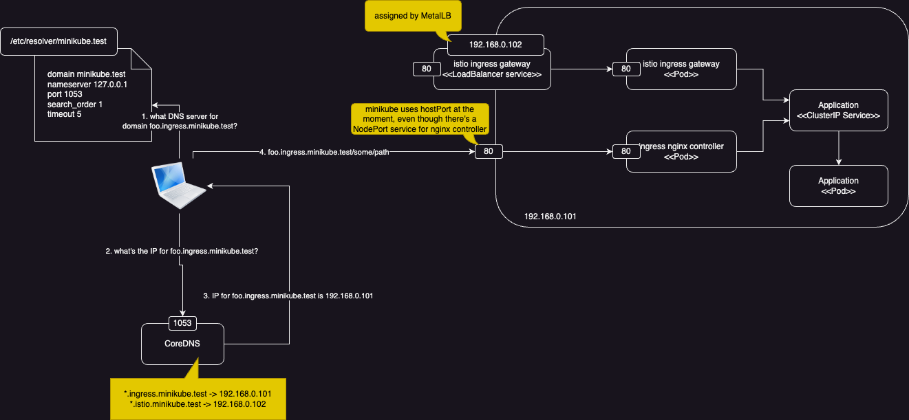

# Introduction

The system that I'm working on has an API deployed to Kubernetes and exposed through Kubernetes Ingress and Istio Gateway (for some historical and technical reasons, we need to use Kubernetes Ingress in some environments and Istio Gateway in others). For local development, we have been using Minikube and:

- [Ingress DNS addon](https://minikube.sigs.k8s.io/docs/handbook/addons/ingress-dns/), which enables nginx ingress controller and deploys a [custom DNS server](https://hub.docker.com/r/cryptexlabs/minikube-ingress-dns) that maps host names in available ingresses to minikube IP. This means we can access ingress using DNS like `http://app.minikube.test`
- [MetalLB](https://metallb.universe.tf/) to assign an accessible IP for Istio ingress gateway load balancer. With this we can access Istio Gateway through port `80` at the assigned IP and don't need to use NodePort

Also worth noting that we want our local development to match other environments as much as possible so using NodePort is not something we are interested in.

This sorts of work until our team all converted to M1/M3 MacBook, which breaks Minikube custom DNS server

This post covers the approach that we come up with

# Solution

What we do is to run a local DNS server (CoreDNS) on the host machine (MacBook) which resolves all DNS requests for specific suffix to either minikube IP (for Kubernetes Ingres) or IP assigned to Istio Ingress Gateway. Below is how it looks like:



## CoreDNS Setup

When we deploy our application to minikube, we also run a CoreDNS container on the host with the following `Corefile` configuration:

```
. {
   log
   errors
   health {
      lameduck 5s
   }
   ready

   template IN A {
      match "ingress\.minikube\.test\.$"
      answer "{{ .Name }} 60 IN A {$INGRESS_CONTROLLER_IP}"
      fallthrough
   }

   template IN A {
      match "istio\.minikube\.test\.$"
      answer "{{ .Name }} 60 IN A {$ISTIO_GATEWAY_IP}"
   }
}
```

this config uses CoreDNS `template` plugin to:

- return value of environment variable `INGRESS_CONTROLLER_IP` (which is set to minikube ip) when DNS request is for domain `*.ingress.minikube.test`
- return value of environment variable `ISTIO_GATEWAY_IP` when DNS request is for domain `*.istio.minikube.test`
    - this variable is set to the IP assigned by MetalLB and can be retrieved using: `kubectl get svc -n istio-system istio-ingressgateway -o json | jq -r '.status.loadBalancer.ingress[0].ip'`

the container is run and listens on port `1053` on the host machine using following command:

```
docker run -d \
    --name coredns \
    -p 1053:53 \
    -p 1053:53/udp \
    -v ./config:/etc/coredns \
    -e INGRESS_CONTROLLER_IP \
    -e ISTIO_GATEWAY_IP \
    coredns/coredns:1.11.1 \
    -conf /etc/coredns/Corefile
```

## Resolver file

Next, we create a resolver file on MacBook at `/etc/resolver/minikube.test`:

```
domain minikube.test
nameserver 127.0.0.1
port 1053
search_order 1
timeout 5
```

basically this file tells Mac to use DNS server at `127.0.0.1:1053` to resolve DNS for any domain with suffix `minikube.test`

And that's it. Now we can use DNS name like `foo.ingress.minikube.test` or `bar.istio.minikube.test` to reach applications `foo`/`bar` deployed to minikube (provided correct `Ingress`/`Gateway`/`VirtualService` are setup)

> Note
> - I use Minikube for demonstration here but nothing here is specific to Minikube (beside the command `minikube ip`)
> - One minor downside/difference of this compared to Minikube Ingress DNS is that it resolves DNS for all requests matching the suffixes, no matter whether there is any `Ingress`/`Gateway` for those domains
