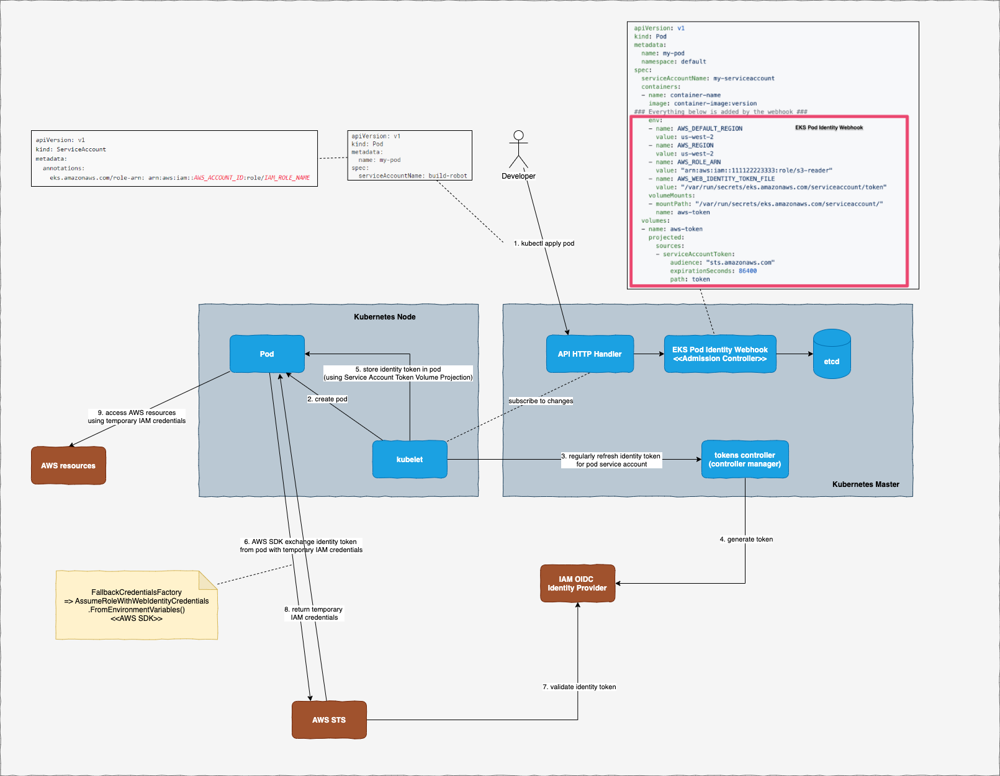

At my current client, we recently switched from [Kiam](https://github.com/uswitch/kiam) to a recently introduced feature from AWS to associate IAM roles with Kubernetes service accounts: [EKS IAM Roles for Service Accounts](https://docs.aws.amazon.com/eks/latest/userguide/iam-roles-for-service-accounts.html). Although the switch was pretty straight forward, many things from EKS Roles for Service Accounts seem pretty magic to me, so I decided to dig a little bit deeper to understand what is going on behind the screen.

Disclaimer: a lot of the things described here are from my own research through different sources and may not be exactly how they are implemented. Feel free to drop me a message if I miss out anything.



The flow is summarised in the diagram above. There are a few components involved in this flow:


# Step 0: Enable EKS OIDC identity provider

As instructed from official AWS guide.

This is so that EKS OIDC identity provider can act as the token issuer for your pods' service accounts. For clusters that are manually managed by yourself, you will need to provide the url to OIDC identity provider as `--service-account-issuer` flag when starting up Kubernetes API server.

For EKS, this should be done automatically for you once you enable EKS OIDC identity provider.

# Step 1: Developers create pod and service account

And annotate service account with the annotation required by EKS (`eks.amazonaws.com/role-arn`)

Example:

```yaml
apiVersion: v1
kind: ServiceAccount
metadata:
  name: my-service-account
  annotations:
    eks.amazonaws.com/role-arn: arn:aws:iam::xxxxxxxxx:role/my-pod-role

---
apiVersion: v1
kind: Pod
metadata:
  name: my-pod
spec:
  serviceAccountName: my-service-account
  containers:
  - name: container-name
    image: container-image:version
```

When this pod definition is submitted to Kubernetes, [EKS Pod Identity Webhook](https://github.com/aws/amazon-eks-pod-identity-webhook) intercepts the request before the pod spec is saved into etcd. This webhook is an admission controller and it modifies the pod spec to add in a few things:

- Environment variables:
  - `AWS_ROLE_ARN`: to be used by AWS SDK later to assume role
  - `AWS_WEB_IDENTITY_TOKEN_FILE`: location of service account token (identity token) to be saved by kubelet
- [A service acount token volume projection](https://kubernetes.io/docs/tasks/configure-pod-container/configure-service-account/#service-account-token-volume-projection)
  This volume projection is used to project/save service account token to the location mounted by the volume.

# Step 2: kubelet creates the pod in worker node

Nothing special here, just regular Kubernetes work

# Step 3: kubelet refreshes service account token regularly

Kubernetes used to leave service account token fixed without any expiration. Recent change in Kubernetes makes kubelet be responsible for regularly refreshing service account token before its expiration. Before the token expires, kubelet will contact tokens controller (one of the controllers defined in Kubernetes controller manager) to generate a new token.

# Step 4: Tokens controller generates a new token

The tokens controller will contact service account issuer defined in step 0 to get a new token for given service account. In EKS, this is the EKS OIDC identity provider.

# Step 5: kubelet projects service account token into the pod

Since the pod has the service account token volume projection defined, the token returned from tokens controller will be projected automatically in the specified location inside the pod.

# Step 6: Pod makes any call to any AWS resource

When application inside pod makes any call to any AWS resource (through AWS SDK), AWS SDK will look up its credentials chain (list of classes that can provide AWS temporary credentials to the request) and use `AssumeRoleWithWebIdentityCredentials` to assume role (defined in environment variable `AWS_ROLE_ARN` above) and exchange identity token for temporary credentials.

This is also the reason why we need to grant permission for the OIDC provider to perform `sts:AssumeRoleWithWebIdentity`.

Reference: [How FallbackCredentialsFactory look like in .NET SDK](https://github.com/aws/aws-sdk-net/blob/a3285fca558b05cfab32719c8c6c9e34023b0908/sdk/src/Core/Amazon.Runtime/Credentials/FallbackCredentialsFactory.cs#L60)

# Step 7: AWS STS validate identity token with OIDC provider

# Step 8-9: Pod uses temporary credentials to access AWS resource

And that's it.

Overall this has been a fun experience for me to trace through different resources to understand the complete flow.
