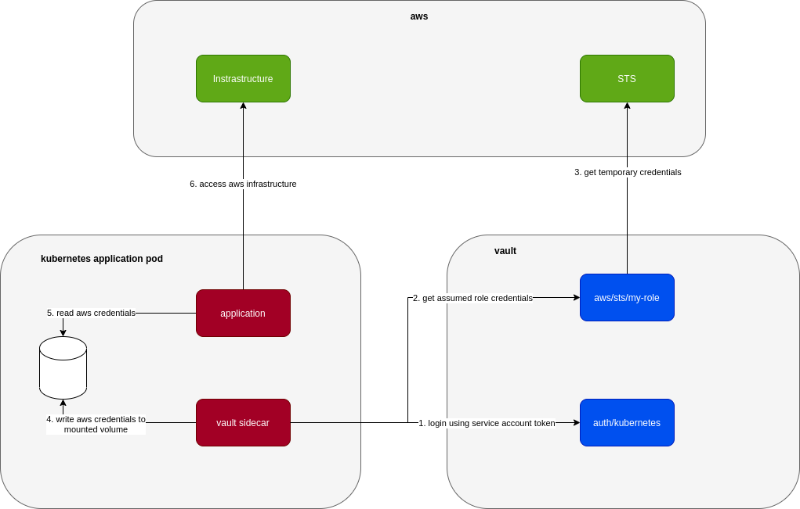
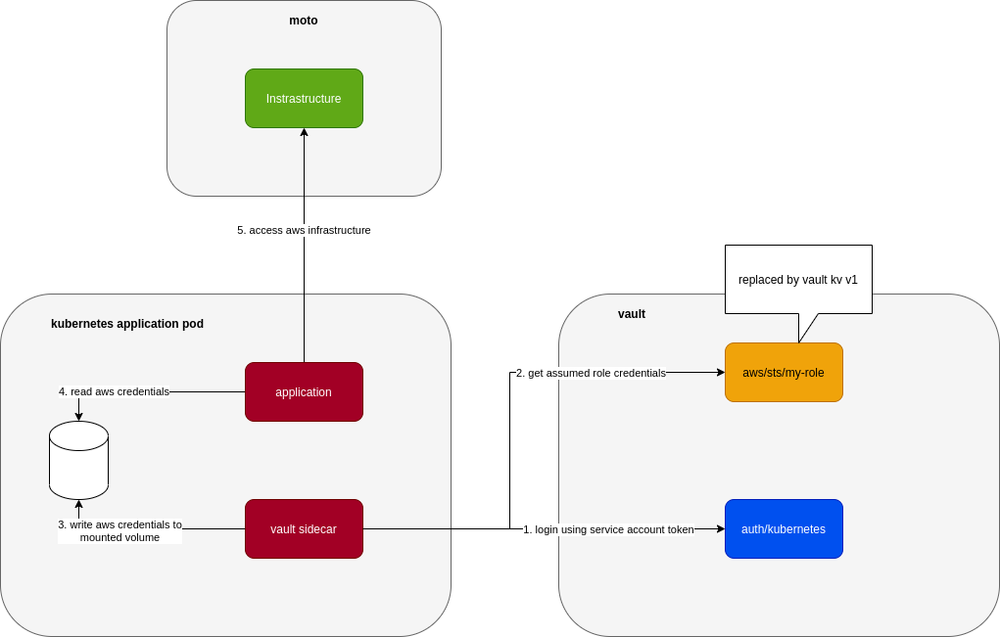

## Introduction

Currently I'm working on a system that's deployed to Kubernetes and uses Hashicorp Vault [AWS Secrets Engine](https://www.vaultproject.io/docs/secrets/aws) to retrieve temporary credentials from assumed roles when it needs to interact with AWS infrastructure.

The system uses a sidecar that's built on top of vault agent to get AWS credentials as below:



In local, the application is deployed to minikube in a very similar way (.i.e. including the vault sidecar, aws infrastructures are replaced with either [localstack](https://localstack.cloud/) or [moto](http://docs.getmoto.org/en/latest/)) so that we can catch issues as early as we can. This poses the challenge of how to let vault sidecar work safely with AWS, in particular the part where it gets AWS temporary credentials. We can let everyone work directly with a test AWS account but there are many issues with that like: troublesome setup, slow, maintain/cleanup real infrastructure in AWS.

So we come up with 2 ways to work around this

## Use Vault KV Secrets Engine V1

to replace Vault AWS Secrets Engine. It looks like this:



Due to the fact that we can use the same way (`vault read` or `vault write`) to work with different secrets engine, we can kind of trick vault into thinking that a key-value v1 secrets engine mounted at `aws` path is an aws secrets engine. As long as we put the test credentials into this kv v1 secrets engine in the same way that vault expects from an aws secrets engine, vault doesn't care that they are different engines.

So when starting up our vault server in minikube, we setup kv v1 as aws secrets engine as below:

```shell
if [ -z "$(vault secrets list | grep aws)" ]; then
  # mount kv v1 to path `aws`
  vault secrets enable -version=1 -path=aws kv
fi
```

And we can put test access key, secret key, security token at path `aws/sts/my-role`, the path where vault expects if it's to request temporary credentials using assumed role `my-role`

```shell
vault kv put aws/sts/my-role access_key=test secret_key=test security_token=test
```

This is simple and works quite well if the vault sidecar only uses `read` to request temporary credentials (.i.e. `vault read aws/sts/my-role`). Once it starts to use `write` like `vault write aws/sts/my-role ttl=60m`, it's broken because underlying engine is still key value. That `write` command just overwrites key `aws/sts/my-role` with `ttl=60m` and all the pre-setup test credentials at that path are lost.

That's why we need to come up with the 2nd trick:

## Use AWS Secrets Engine with Moto

Turn out Moto is able to simulate IAM quite well that we can point vault aws secrets engine to it without any problem. Localstack also has suppot for IAM but it's only available in its Pro version, makes it not so attractive for local development.

When using Moto, our setup is even closer to how it works in production:


Basically instead of AWS, we just plug in Moto. The local setup to point local vault to Moto is a bit more involved:

- First we need to enable aws secrets engine:

```shell
if [ -z "$(vault secrets list | grep aws)" ]; then
    vault secrets enable -path=aws aws
fi
```

- and then configure aws secrets engine to point to Moto instead of AWS:

```shell
vault write aws/config/root \
    access_key=test \
    secret_key=test \
    region=us-east-1 \
    iam_endpoint=http://moto:5000 \
    sts_endpoint=http://moto:5000
```

- finally create the role to be assumed in aws secrets engine

```shell
vault write aws/roles/my-role \
    role_arns=arn:aws:iam::000000000000:role/my-role \
    credential_type=assumed_role
```

## Code

Example code for above 2 approaches can be found at [vault-fake-aws](https://github.com/hpcsc/vault-fake-aws)
