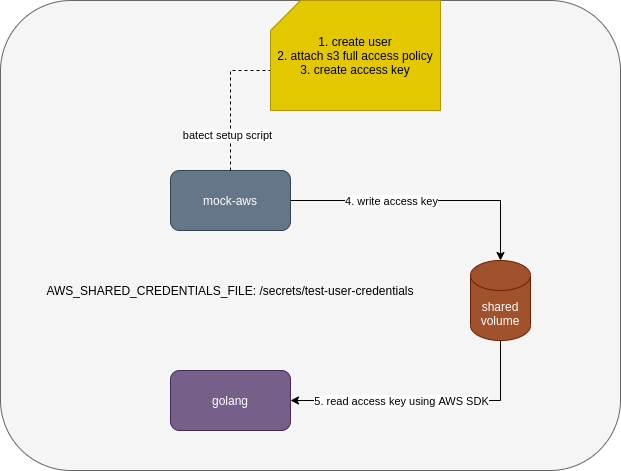
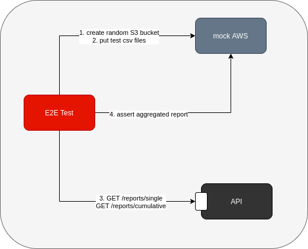
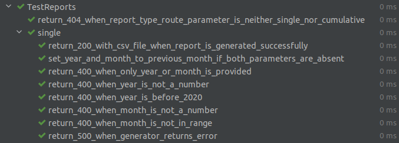
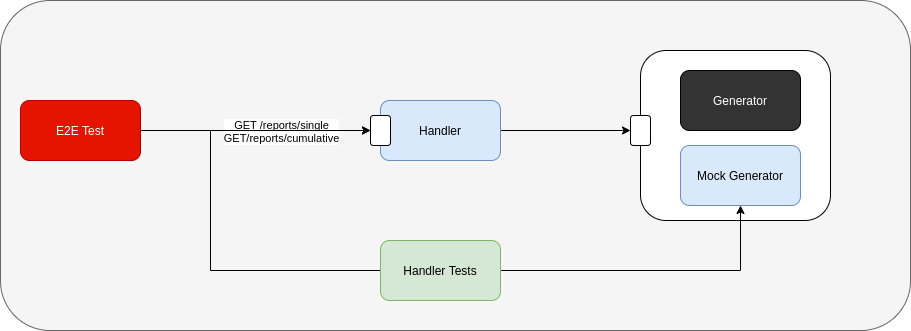
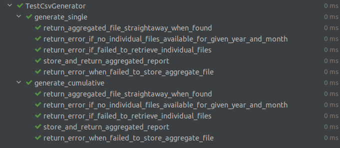
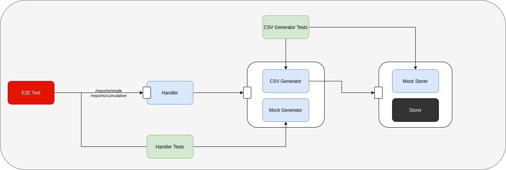
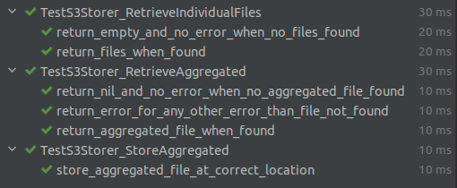
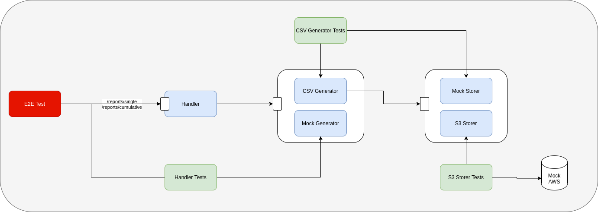

## Introduction

I always find it challenging to find a non-hello-world walkthrough of TDD on the internet. Recently when I had a chance to implement a complete feature using outside-in TDD in my current project, I thought it's a good time to document the more realistic process.

In this post, you'll find find a structured approach to test drive an API, from its external endpoints down to its boundary/external dependencies. From this, the advantage of doing TDD and its role in application design get to shine.

Warning: it's a long post. I'll go slower at the beginning and speed it up towards the end when we are already familiar with the thought process.

[Github repository](https://github.com/hpcsc/outside-in-go) for the code in this blog post

## The feature

My current system has csv report files stored in AWS S3 according to created year and month:

```
s3://outside-in-go/2022/03/single/cluster-{1..n}.csv
s3://outside-in-go/2022/03/cumulative/cluster-{1..n}.csv
```

Data come from multiple kubernetes clusters. `single` files store data created within that month. `cumulative` files store data created up to the end of that month. Format of the csv files is not important but each csv file has a header in the first line, so they look like:

```
HEADER 1,HEADER 2
data-1,data-2
```

The feature that I'm to implement is to add an endpoint to our API that allows users to download reports with combined data from all clusters for a specific year/month. Some more requirements:

- If year/month are not specified in the endpoint url, it's default to previous month
- The first time a report is requested, it should combine data from all clusters and stores it as an aggregated report file in S3 for subsequent retrieval.

This feature is ideal for a more real-world outside-in TDD demonstration in my opinion: It's not a hello world application, it's not too simple nor too complicated, it also needs to integrate with external services (AWS S3)

## Initial set up

Before writing any code, we need to have necessary set up to run unit/integration/end-to-end (e2e) tests. In this case there are quite a number of things to set up:

- task runner: I usually use [batect](https://batect.dev/) as the task runner to run tests inside containers
- mock aws: I'm going to use [moto](https://github.com/spulec/moto) to simulate AWS S3. To make it realistic, I'm going to enable moto [IAM-like Access Control](http://docs.getmoto.org/en/latest/docs/iam.html) (moto by default doesn't authenticate/authorize requests). That also means we need to set up a new user with access key and permission to S3. This is done by a batect setup script:

```shell
USERNAME=test-user

aws iam create-user \
    --user-name "${USERNAME}" \
    --endpoint http://127.0.0.1:5000

aws iam attach-user-policy \
    --endpoint http://127.0.0.1:5000 \
    --user-name "${USERNAME}" \
    --policy-arn arn:aws:iam::aws:policy/AmazonS3FullAccess

CREDENTIALS=$(aws iam create-access-key \
    --endpoint http://127.0.0.1:5000 \
    --user-name "${USERNAME}")

aws configure set aws_access_key_id "$(echo "${CREDENTIALS}" | jq -r '.AccessKey.AccessKeyId')"
aws configure set aws_secret_access_key "$(echo "${CREDENTIALS}" | jq -r '.AccessKey.SecretAccessKey')"
```

Since this script is run in moto container, golang container that we use to run tests will not have access to the new user credentials without explicit file sharing. The script above uses `aws configure` to create AWS credentials file in the location set by `AWS_SHARED_CREDENTIALS_FILE` variable (`/secrets/test-user-credentials`). This file will be mounted to golang container and made available to AWS SDK for Go through variable `AWS_SHARED_CREDENTIALS_FILE`



## End to end/API test

Outside-in TDD usually starts with an end to end test. In our case, the test will test the happy path:

- Create a bucket in S3, populate it with individual cluster csv files
- Hit report endpoint
- Expect a csv file is returned in the response. We don't need to make detailed assertions on the format of the returned csv. Those should be verified in lower level tests.
- Expect an aggregated csv file exists in S3 at correct location

Although it sounds simple, I find it challenging to get it right in the 1st attempt since we need to do necessary set up for the test to interact with mock aws (moto). This is also the part where we need to write largest amount of test code up front before writing any production code.

Before writing the test, there are a number of design decisions we need to make:

- What endpoint the test should hit? To follow Restful API, I probably consider `single` and `cumulative` as two resources that belong to `reports` collection, so the endpoint looks like: `/reports/[single|cumulative]`. We also need to pass in year and month to query, those can be query parameters to the endpoint: `/reports/[single|cumulative]?year=xxxx&month=yy`. This is only one way to approach it, another way can be treating `single report` and `cumulative report` as different sub resources, further divided by year and month, something like `/reports/single/xxxx/yy` and `/reports/cumulative/xxxx/yy`. For now I prefer 1st approach
- Where should we store aggregated csv in S3 (we need to verify this in the test)? We can store a file with name `aggregated.csv` in the same S3 location as single/cumulative csv files, .i.e. `s3://outside-in-go/2022/03/[single|cumulative]/aggregated.csv`. We can also store it in a separate path like `s3://outside-in-go/2022/03/aggregate/[single|cumulative].csv`. I like separate path more, since we don't need special handling when reading individual csv files for the 1st time (if we store aggregate file in the same location as individual csv files, we will need to filter it out when readding individual files in case the aggregate file is mistakenly put there)

As you can see, the end to end test already forces us to think about design of the new feature before writing any production code. Here's the first e2e test:

```go
// e2e/download_report_test.go
func TestReportEndpoint(t *testing.T) {
	t.Run("store aggregated file in s3 and return it", func(t *testing.T) {
		bucket := os.Getenv("BUCKET")
		previousMonth := time.Now().AddDate(0, 0, -time.Now().Day())
		s3Client := s3ClientToMockAws(t)
		newEncryptedS3Bucket(t, s3Client, bucket)
		putTestCsvAtPath(t, s3Client, bucket, fmt.Sprintf("%d/%02d/single/cluster-1.csv", previousMonth.Year(), previousMonth.Month()))
		putTestCsvAtPath(t, s3Client, bucket, fmt.Sprintf("%d/%02d/single/cluster-2.csv", previousMonth.Year(), previousMonth.Month()))

		apiUrl := os.Getenv("API_URL")
		resp, err := http.Get(fmt.Sprintf("%s/reports/single", apiUrl))
		require.NoError(t, err)

		require.Equal(t, http.StatusOK, resp.StatusCode)
		responseBodyIsAggregatedReport(t, resp)
		aggregatedReportExistsInS3(t, s3Client, bucket, previousMonth)
	})
}
```

What this test does is:

- create a S3 bucket. We need to pass the bucket name in from environment variable because the e2e test and the api will need to share the same bucket and I don't want to hardcode it in the test.
- put 2 csv files to that bucket at the expected location
- make the call to the API (which doesn't exist yet)
- assert that the returned response from the API is csv file and contains data from above 2 csv files
- assert that the aggregated file exists in S3

There are a few helper functions used in the test like `s3ClientToMockAws`, `newEncryptedS3Bucket` to hide irrelevant setup details and help with readability of the test.

Visually, this is how it looks like at the moment:



Note that at this point, API is like a black box to us. The only thing we know is how the endpoint is supposed to look like

Run the test and we should have this error:

```
=== RUN   TestReportEndpoint/store_aggregated_file_in_s3_and_return_it
    download_report_test.go:32:
                Error Trace:    download_report_test.go:32
                Error:          Received unexpected error:
                                Get "http://app:3333/reports/single": dial tcp: lookup app: Temporary failure in name resolution
                Test:           TestReportEndpoint/store_aggregated_file_in_s3_and_return_it
```

This is expected. The app container is just a hello world container and doesn't expose any endpoint and exits immediately after printing hello world at the moment.

## Handler

### First test

To fix the above error in e2e test, we need to have a server that responds to that endpoint. I'm going to use [chi](https://github.com/go-chi/chi) as the router for this server. Now we need to shift our focus to one level lower and think about how to design our route. We have made some decisions when writing e2e test earlier regarding how the endpoint should look like so we should be able to write tests to verify those behaviors:

- `reports` resource only supports 2 types: `single` and `cumulative`, so any other type passed in should be rejected with 404 response
- the endpoint also takes 2 query parameters `year` and `month` and we know that there are several requirements for those 2 parameters:
    - `year` and `month` are either both provided, or none provided. If only one of them is provided, the request should be rejected with 400 response
    - `year` should not be too long ago, we don't have data that far. For this example, let's say `year` cannot be before 2020
    - `month` should be valid, .i.e. from 1 to 12
    - if both `year` and `month` are missing, they have default values of previous month

All of above are related to validation of route/query parameters and should be handled by the API handler. We know that there is some other logic regarding aggregating individual csv files into an aggregated file but those don't belong to handler. We don't know how the logic going to look like yet, but we do know that our handler needs to interact with another component to perform that logic. Now is the right time to think about the public interface of that component and how the handler is going to interact with it because we will need to mock that public interface in the handler tests.

I'm going to call that component `report.Generator`. It needs to be able to generate single or cumulative reports. There are 3 designs that I think of at the moment:

```go
// stateless
type Generator interface {
    Generate(reportType ReportType, year int, month int) ([]byte, error)
}
```

or

```go
// stateless
type Generator interface {
    GenerateSingle(year int, month int) ([]byte, error)
    GenerateCumulative(year int, month int) ([]byte, error)
}
```

or

```go
// need to carry a state of report type to generate. Each report type needs an instance of `Generator`
type Generator interface {
    Generate(year int, month int) ([]byte, error)
}
```

I don't like 1st approach since `reportType` is an example of [flag argument](https://martinfowler.com/bliki/FlagArgument.html) and generally not as clear as the other two approaches. I have no strong preference between approach 2 and 3. For now I settle with approach 2.

With that decision, we can add 2 more test cases to the list of tests for handler:

- handler returns 500 error when generator has any error
- handler returns 200 when everything's good

Let's write our first unit test for reports handler:

```go
func TestReports(t *testing.T) {
	t.Run("return 404 when report type route parameter is neither single nor cumulative", func(t *testing.T) {
		req, err := http.NewRequest("GET", "/reports/not-valid", nil)
		require.NoError(t, err)
		recorder := httptest.NewRecorder()
		stubGenerator := report.NewMockGenerator()
		router := testRouterWithReports(stubGenerator)

		router.ServeHTTP(recorder, req)

		require.Equal(t, http.StatusNotFound, recorder.Code)
	})
}

func testRouterWithReports(generator report.Generator) *chi.Mux {
	r := chi.NewRouter()
	r.Use(middleware.Recoverer)
	RegisterReportsRoutes(r, generator)
	return r
}
```

There are a lot of compilation errors in above test since we don't have anything yet. But writing this test first lets us think about how clients/users are going to use the handler and how the handler interacts with its dependencies:

- clients (.e.g. e2e test) invoke the handler through a GET endpoint
- the handler has one dependency, which is report generator component in `report` package. At the moment, all we need is a mock instance of report generator that conforms to the public interface we designed above. We will have a function `report.NewMockGenerator` to return that mock instance. We are also going to inject it to reports handler when setting up router using `RegisterReportsRoutes`

For the code to be compilable:

- Install chi library
- Add `report` package with empty interface and empty mock generator:

```go
// internal/report/generator.go
type Generator interface {
}

// internal/report/mock_generator.go
var _ Generator = &mockGenerator{}

type mockGenerator struct {
}

func NewMockGenerator() *mockGenerator {
	return &mockGenerator{}
}
```

- Add minimum code to `internal/handler/reports.go`:

```go
func RegisterReportsRoutes(router *chi.Mux, generator report.Generator) {
}
```

Run the test now and it should pass because we haven't registered any route to chi router yet.

### Second test

I usually add a few negative cases before writing test for the happy path but in this case, I choose the happy path test for 2nd test case, to make this article a shorter read.

```go
// internal/handler/reports_test.go
func TestReports(t *testing.T) {
    // ...

	t.Run("single", func(t *testing.T) {
		t.Run("return 200 with csv file when report is generated successfully", func(t *testing.T) {
			req, err := http.NewRequest("GET", "/reports/single?year=2022&month=4", nil)
			require.NoError(t, err)
			recorder := httptest.NewRecorder()
			stubGenerator := report.NewMockGenerator()
			stubGenerator.On("GenerateSingle", mock.Anything, mock.Anything).Return([]byte("some,csv,data"), nil)
			router := testRouterWithReports(stubGenerator)

			router.ServeHTTP(recorder, req)

			assert.Equal(t, http.StatusOK, recorder.Code)
			assert.Equal(t, "text/csv", recorder.Header().Get("Content-Type"))
			assert.Equal(t, "attachment; filename=single-202204.csv", recorder.Header().Get("Content-Disposition"))
			assert.Equal(t, "some,csv,data", recorder.Body.String())
		})
	})
}
```

We return some stubbed data from generator and expect the handler to return data (response header, body) as expected. Pretty straightforward.

Here's the implementation code that makes the test pass. Notice that all the error handling is ignored. That's supposed to be implemented in other negative test cases.

```go
// internal/handler/reports.go
const (
	reportsSingleRoutePattern = "/reports/single"
)

func RegisterReportsRoutes(router *chi.Mux, generator report.Generator) {
	h := &reportsHandler{
		generator: generator,
	}
	router.Get(reportsSingleRoutePattern, h.Single)
}

type reportsHandler struct {
	generator report.Generator
}

func (h *reportsHandler) Single(w http.ResponseWriter, r *http.Request) {
	yearParam := r.URL.Query().Get("year")
	monthParam := r.URL.Query().Get("month")

	year, _ := strconv.Atoi(yearParam)
	month, _ := strconv.Atoi(monthParam)

	data, _ := h.generator.GenerateSingle(year, month)

	w.WriteHeader(http.StatusOK)
	w.Header().Set("Content-Type", "text/csv")
	w.Header().Set("Content-Disposition", fmt.Sprintf("attachment; filename=single-%d%02d.csv", year, month))
	w.Write(data)
}
```

### Remaining tests

I'm not going to bother you with the remaining tests. Once done, the tests should look like this



### Cumulative endpoint

Cumulative endpoint and its tests are almost duplicate of single endpoint/tests. To avoid a lot of duplication in tests, I extract single endpoint tests to a common test suite and use them for cumulative endpoint. For more details, please refer to the github repository.

with handler and handler tests done, our mental model should look like this:



e2e test is still failing. Handler and handler tests work with public interface and mock implementation from generator package. The actual generator logic is not yet implemented and is still a black box to us.

## Report Generator

By now the generator public interface is more or less finalised. Let's think a little bit about expected behavior of the generator and its dependency:

- Given a year and month as input, it should get all individual csv files for that specific year and month from S3, merge/aggregate them together, store aggregated file in S3 for subsequent retrieval. Should it interact with S3 using AWS SDK directly? Absolutely not. There is some logic in this generator and embedding S3 logic in this component makes it very difficult to effectively test that generator logic. For that reason, we need another abstraction that interacts with S3. This abstraction is at the boundary of the system and acts as a gateway/client wrapper to S3. Many people like to call that abstraction `S3Client` or something along that line. Personally I don't like that naming style. Naming it `S3Client` makes the underlying S3 implementation leaked to the upper layer. Does the generator care whether the individual files stored in S3? No, it just needs individual files to do its aggregation logic. Those files can come from S3, from filesystem, it doesn't matter. I'm going to call that abstraction `Storer` and it looks like:

```go
// internal/storer/storer.go
type ReportType string

const (
	SingleReportType ReportType = "single"
	CumulativeReportType ReportType = "cumulative"
)

type Storer interface {
	RetrieveIndividualFiles(reportType ReportType, year int, month int) ([][]byte, error)
	RetrieveAggregated(reportType ReportType, year int, month int) ([]byte, error)
	StoreAggregated(reportType ReportType, year int, month int, data []byte) error
}
```

- We already have the public interface for the generator when implementing the handler:

```go
type Generator interface {
	GenerateSingle(year int, month int) ([]byte, error)
	GenerateCumulative(year int, month int) ([]byte, error)
}
```

with that, we can devise a few test cases for the generator:

- if aggregated file exists for given year/month (.i.e. `Storer.RetrieveAggregated` returns not nil), it should return that straightaway
- if aggregated file does not exists and no individual files for given year/month, it should return an error
- if aggregated file does not exists and individual files for given year/month exist, it should aggregate those files together, store it to correct location and return aggregated file
- other error handling test cases
- same behavior for `GenerateSingle` and `GenerateCumulative`

### First test

First test verifies that if aggregated file found, it's returned straightaway:

```go
// internal/report/csv_generator_test.go
func TestCsvGenerator(t *testing.T) {
	t.Run("generate single", func(t *testing.T) {
		t.Run("return aggregated file straightaway when found", func(t *testing.T) {
			year := 2022
			month := 4
			stubStorer := storer.NewMock()
			stubStorer.StubRetrieveAggregated(storer.SingleReportType, year, month).Return([]byte("some,data"), nil)
			g := NewCsvGenerator(stubStorer)

			data, err := g.GenerateSingle(year, month)

			require.NoError(t, err)
			require.Equal(t, []byte("some,data"), data)
			stubStorer.AssertRetrieveIndividualFilesNotCalled(t)
			stubStorer.AssertStoreAggregatedNotCalled(t)
		})
	})
}
```

Again, this test is created against storer interface that we haven't had yet and there are a lot of compilation errors. To make it compilable, we need to:

- Add storer package with interface and a mock implementation of that interface
- Add empty csv generator:

```go
// internal/report/csv_generator.go
var _ Generator = &csvGenerator{}

func NewCsvGenerator(storer storer.Storer) Generator {
	return &csvGenerator{}
}

type csvGenerator struct {
}

func (g *csvGenerator) GenerateSingle(year int, month int) ([]byte, error) {
	return nil, nil
}

func (g *csvGenerator) GenerateCumulative(year int, month int) ([]byte, error) {
	return nil, nil
}
```

Now we have a failing test. Add minimum code to make it pass:

```go
// internal/report/csv_generator.go
func NewCsvGenerator(storer storer.Storer) Generator {
	return &csvGenerator{
		storer: storer,
	}
}

type csvGenerator struct {
	storer storer.Storer
}

func (g *csvGenerator) GenerateSingle(year int, month int) ([]byte, error) {
	cachedAggregated, _ := g.storer.RetrieveAggregated(storer.SingleReportType, year, month)
	if cachedAggregated != nil {
		return cachedAggregated, nil
	}

	return nil, nil
}
```

### Remaining tests

With dependency and behavior well defined, finishing up the remaining tests and implementation is straightforward. The most important thing is that during the process, writing tests first gets us to think about the component input, output, dependencies and how they interact with each other. And I hope you realise by now: whenever we write tests for a component, we are also designing public interface for its dependencies.

Below is the list of tests for generator that I have at the end. Full code is available in github



Our current state looks like this:



## Storer

We have come to the boundary of our system where we need to interact with external dependency (AWS S3). Unfortunately it's difficult to write unit tests for these boundary components. Or to be more exact, I don't find much value writing unit tests for these components. To write unit tests here, we need to mock third party library (AWS SDK for Go in this case), which involves a lot of assertions whether we call third party library functions with correct parameters. This is bad in my opinion because:

- This makes the tests very tightly coupled to third party library that we don't have control over. Any change in third party library can potentially break all our tests.
- It also doesn't give me the confidence that integration with the external dependency is correct. All we verify is whether we pass parameters that we "think" are correct to third party libraries. A lot of time those assumptions are not correct. The only way to know whether it works is to actually call the library with the external dependency or a fake implementation of that external dependency.

Long story short, integration tests are better for components at the boundary of the system. Integration test is an overloaded term. For me integration tests are tests involving any out-of-process dependency like a database, a mock http server etc. The feedback cycle is much slower compared to unit tests and we also can't write tests for all scenarios (.e.g. to verify when aws sdk returns an error), but we still can write tests first.

We already have mock aws container setup in e2e test so we can jump straight to the tests. The storer interface has 3 functions: `RetrieveIndividualFiles`, `RetrieveAggregated` and `StoreAggregated`. I'm showing tests for `RetrieveIndividualFiles` only:

```go
// internal/storer/s3_storer_test.go
func TestS3Storer_RetrieveIndividualFiles(t *testing.T) {
	t.Run("return empty and no error when no files found", func(t *testing.T) {
		s3Endpoint := os.Getenv("S3_ENDPOINT")
		bucket := randomName("bucket")

		client := s3ClientToMockAws(t, s3Endpoint)
		newEncryptedS3Bucket(t, client, bucket)

		s, err := NewS3Storer(s3Endpoint, bucket)
		require.NoError(t, err)
		data, err := s.RetrieveIndividualFiles(SingleReportType, 2022, 4)

		require.NoError(t, err)
		require.Empty(t, data)
	})
}
```

Minimum code to make it pass:

```go
// internal/storer/s3_storer.go
var _ Storer = &s3Storer{}

type s3Storer struct {
}

func NewS3Storer(endpoint string, bucket string) (Storer, error) {
	return &s3Storer{}
}

func (s *s3Storer) RetrieveIndividualFiles(reportType ReportType, year int, month int) ([][]byte, error) {
	return [][]byte{}, nil
}

// ...
```

2nd test verifies happy path. There are some similarities between this test and the e2e test that we have earlier around the S3 client set up and assertions so we can borrow a number of helper functions from e2e test:

```go
// internal/storer/s3_storer_test.go
t.Run("return files when found", func(t *testing.T) {
	s3Endpoint := os.Getenv("S3_ENDPOINT")
	bucket := randomName("bucket")

	client := s3ClientToMockAws(t, s3Endpoint)
	newEncryptedS3Bucket(t, client, bucket)
	putTestCsvAtPath(t, client, bucket, "2022/04/single/cluster-1.csv")
	putTestCsvAtPath(t, client, bucket, "2022/04/single/cluster-2.csv")

	s, err := NewS3Storer(s3Endpoint, bucket)
	require.NoError(t, err)
	data, err := s.RetrieveIndividualFiles(SingleReportType, 2022, 4)

	require.NoError(t, err)
	require.Len(t, data, 2)
	expected := [][]byte{
		[]byte(fmt.Sprintf("BUCKET,PATH\n%s,2022/04/single/cluster-1.csv", bucket)),
		[]byte(fmt.Sprintf("BUCKET,PATH\n%s,2022/04/single/cluster-2.csv", bucket)),
	}
	require.Equal(t, expected, data)
})
```

To make the test pass, we need to write a lot more production code in one go. This is understandable because we are interfacing with external dependency using a third party library that we don't have control over. It's not easy (most of the time impossible) to configure the library to return errors for our tests. So we will need to write all of those error handling without any test to verify the behavior and assume that they will work in production.

```go
// internal/storer/s3_storer.go
func (s *s3Storer) RetrieveIndividualFiles(reportType ReportType, year int, month int) ([][]byte, error) {
	prefix := fmt.Sprintf("%d/%02d/%s", year, month, reportType)
	listResponse, err := s.client.ListObjectsV2(context.TODO(), &s3.ListObjectsV2Input{
		Bucket: aws.String(s.bucket),
		Prefix: aws.String(prefix),
	})
	if err != nil {
		return nil, fmt.Errorf("failed to list objects at %s: %v", prefix, err)
	}

	var result [][]byte
	for _, f := range listResponse.Contents {
		object, err := s.client.GetObject(context.TODO(), &s3.GetObjectInput{
			Bucket: aws.String(s.bucket),
			Key:    f.Key,
		})
		if err != nil {
			return nil, fmt.Errorf("failed to get object at %s: %v", *f.Key, err)
		}

		content, err := ioutil.ReadAll(object.Body)
		if err != nil {
			return nil, fmt.Errorf("failed to read object content at %s: %v", *f.Key, err)
		}

		result = append(result, content)
	}

	return result, nil
}
```

This function looks complicated, but it only does 2 things:

- Get a list of csv file names for the given report type/year/month
- For each file name, get actual file content as byte slice

The other 2 functions (`RetrieveAggregated`, `StoreAggregated`) from S3 storer implementation are done in the same way.



The system state now looks like:



Would the e2e test pass now if we run it again? Not yet. We already have all the components implemented and tested independently, now what's left is to wire up the handler and its dependencies in the main function using chi router:

```go
// cmd/outside-in-go/main.go
func main() {
	r := chi.NewRouter()
	r.Use(middleware.Logger)

	handler.RegisterReportsRoutes(r, newReportGenerator())

	addr := fmt.Sprintf(":%s", port)
	http.ListenAndServe(addr, r)
}

func newReportGenerator() report.Generator {
	s, err := storer.NewS3Storer(s3Endpoint, bucket)
	if err != nil {
		log.Fatalf("%v", err)
	}
	gen := report.NewCsvGenerator(s)
	return gen
}
```

Run the e2e test now and it will pass. We have done it.

## Run the API

To try the api:

```shell
./batect run # Run mock aws container and then api container
./batect run-setup # Use aws cli to create the bucket and put several csv files in the location of previous month
curl http://localhost:3333/reports/single
```

You should see aggregated report data from 2 clusters:

```
REPORT,CLUSTER
single,cluster-1
single,cluster-2
```

## Reflections

That's a long but enjoyable journey, at least for me. A few things to reflect after the whole thing is done:

- Was it really that smooth as described in this article? No, this is a complicated workflow and I can't say I have mastered it despite having done it several times now. When I implemented this feature the first time, I needed to go back and forth because I realised the public interface I designed didn't really work. If the project's started from scratch, there's a lot of overhead at the beginning to set up dependencies (moto/mock aws in this case) and all the boilerplate/foundation too.
- I have mentioned this above but I also come to realise that when writing tests for a component, we are also actually designing public interface for its dependencies. We need to think about the dependency's behaviors before implementing it. That public interface will become requirements for the dependency when it's time to implement it.
- My relationship with mocks has been changing over time:
  - Before I started at ThoughtWorks (2016), I didn't practise TDD at all and mocks were not very important in my toolbox.
  - In the first few years at ThoughtWorks, I started to write more tests (some TDD, some not TDD). I considered mocks as something bad (.e.g. mocks make my tests tightly coupled with internal implementation details, mocks only verify interactions, which say nothing about final outcome - note: this was my own learning and gathering from various sources. It doesn't represent ThoughtWorks' stand points on this).
  - Now I started to appreciate mocks and their role in the designing process more. My thinking about mocks is similar to what Isaiah has described in [this post](https://isaiahperumalla.wordpress.com/2008/04/25/test-driven-design-using-mocks-%e2%80%93-lessons-learnt-part-1/)
