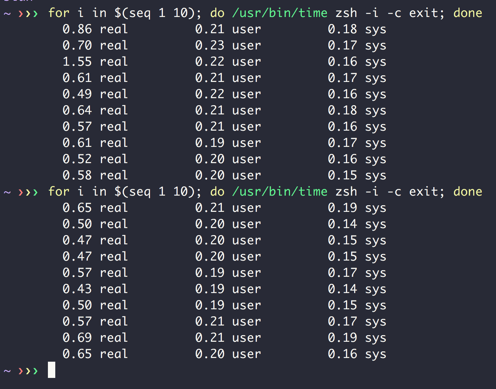
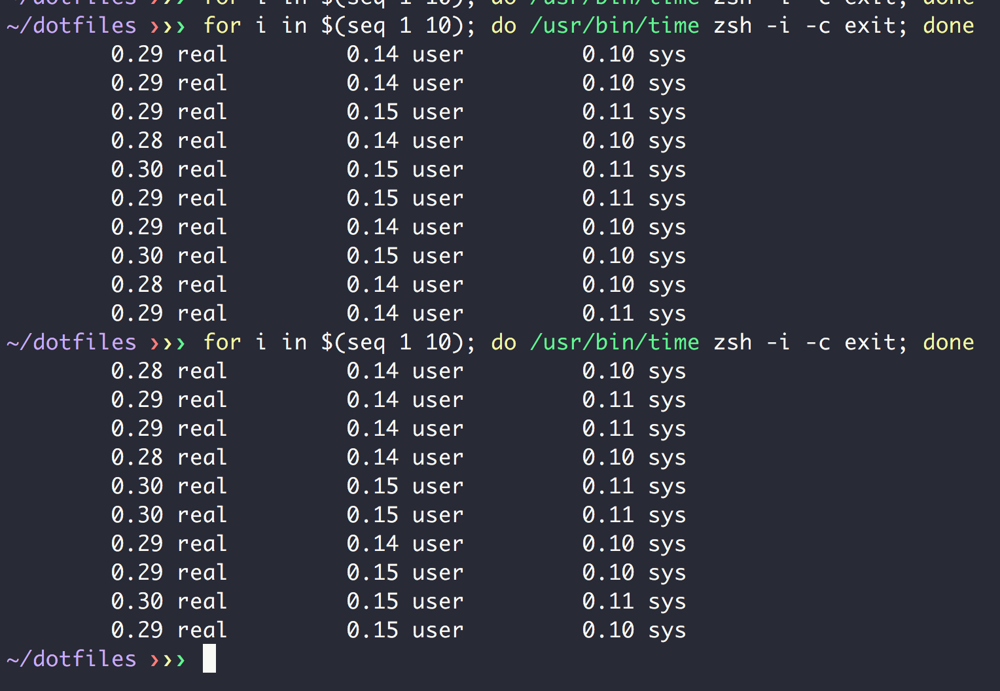

I have been using zsh with Prezto for a few years and have always been conscious about what stuffs to put in my shell profile files like `.zshrc` so that a new shell can start as fast as it can.

If comparing the startup time of my shell to shell startup time of most other people who I have worked with, my current startup time is not bad:



In average, it takes around 0.5s to start.

However today I manage to speed it up even further, using zsh autoloading of custom functions. The idea comes from this SOF answer: [https://unix.stackexchange.com/a/33898](https://unix.stackexchange.com/a/33898). In short, when you use `autoload` command with a file name, zsh will mark it to be loaded automatically upon its first reference. The content of the file is going to be function body and name of the file will be function name. `fpath` variable contains the search path for files that can be marked to be loaded automatically upon first usage.

This feature can help to speed up my zsh startup time because I have quite a number of custom shell functions defined in a custom folder. Before this change, my `.zshrc` sourced all these files when starting up, even though I may not use it in current shell session:

``` shell
for func_def in ~/.functions/*; do
    source "$func_def"
done
```

With autoloading feature, I can "lazy load" those custom functions and only load a function from the definition file whenever I use it for the first time. My `.zshrc` calls `autoload` to mark the custom functions to be loaded automatically (this call is not loading the actual files so will be much faster than using `source`)

``` shell
fpath=($fpath ~/.functions)
autoload -Uz ~/.functions/**/*
```

Here's the resutl after using `autoload`:



It takes 0.3s now, that's 40% faster than before.

However this change also introduces a difficulty to my dotfiles installation script. Before this change, I just need to source and export files containing those custom functions at the beginning of the installation script, the remaining of the script can use those exported functions easily. With `autoloading`, each file now is expected to contain body of a function. Sourcing those files will execute those body immediately at sourcing time, which is not what I want. So I need to come up with an ugly trick to load these custom functions at the beginning of my dotfiles installation script:

``` shell
autoload_functions=(
  execute
  echo_with_color
  is_macos
  is_ubuntu
  distro_name
  #...
)

for f in "${autoload_functions[@]}"
do
  eval "
    function $f() {
      $(cat ./link/common/zsh/.functions/misc/$f)
    }
  "
done
```

This script basically `cat` function body from those `autoload` files, and uses `eval` to define a function with the same name with the file
