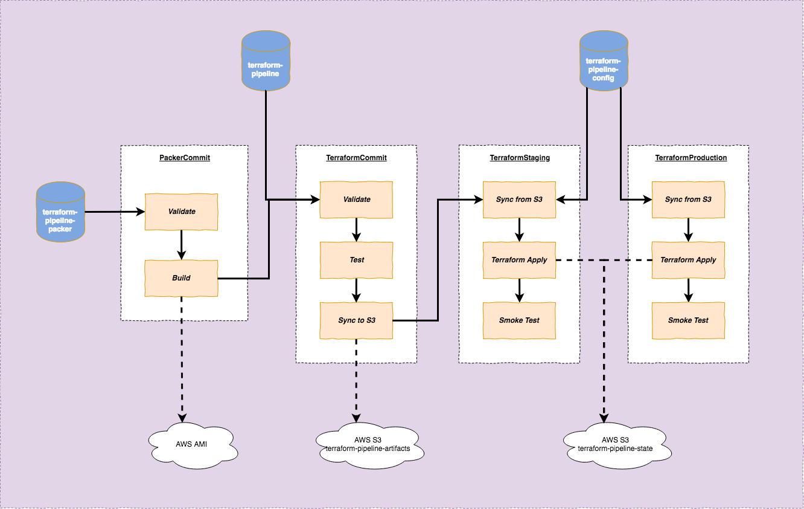
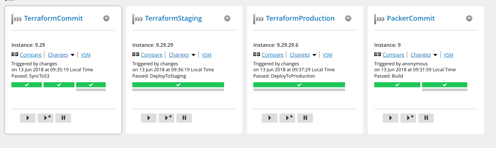
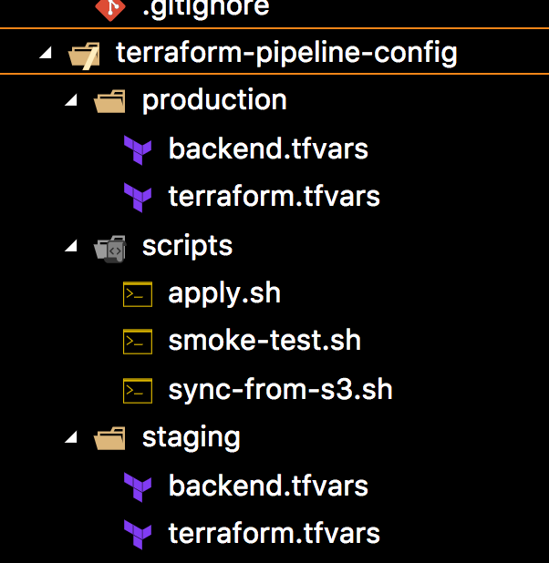
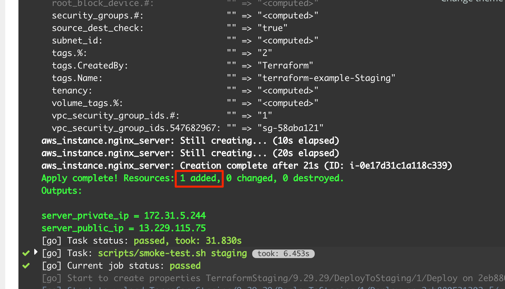
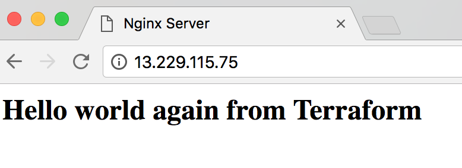
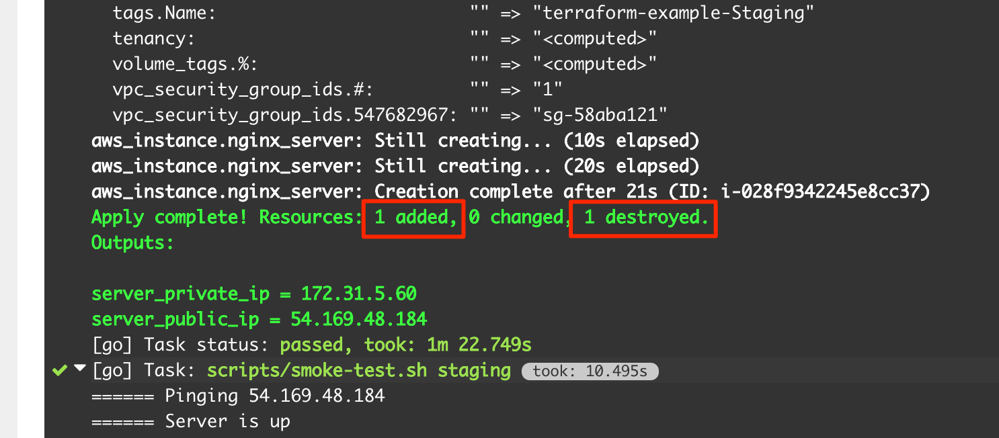
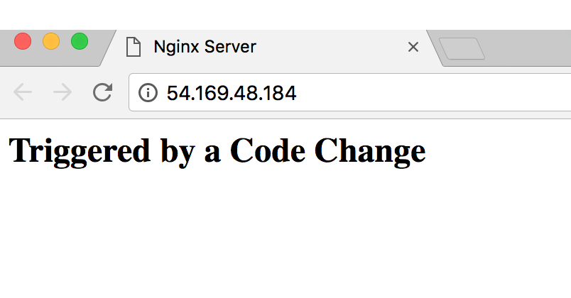

## Introduction

In my current project, I have a chance to use Terraform and Packer to automate the process of setting up a new testing environment in AWS. However I always feel something is not right. Terraform is a tool that promotes infrastructure as code, immutable infrastructure, but what we do in this project doesn't align to those principles:

- after the servers are created using Terraform, they are maintained manually (.i.e. software is installed/updated by ssh-ing to the servers and updating directly there). After a while, server configuration is drifting away from Terraform code (an issue known as configuration drift)
- Terraform code is version controlled, however it's not truly treated as `code`, i.e. there's no testing, no integration, no build pipeline to ensure new commit doesn't break any server configuration, no automated application of Terraform code to actual environments

After digging through several online resources ([Using Pipelines to Manage Environments with Infrastructure as Code](https://medium.com/@kief/https-medium-com-kief-using-pipelines-to-manage-environments-with-infrastructure-as-code-b37285a1cbf5)) and book ([Terraform: Up and Running](https://www.amazon.com/Terraform-Running-Writing-Infrastructure-Code/dp/1491977086/ref=sr_1_1?ie=UTF8&qid=1528855626&sr=8-1&keywords=terraform+up+and+running)), I have a better understanding of how to structure a build pipeline to automate Terraform build and deploy process. Although those resources give me an initial idea, they lack actual code demonstration. So I'm creating a pipeline myself to test my knowledge, and to create a sample for future reference. I'm going to walk through the main points of the pipeline below.

## Tools

For CI, I use GoCD. Nothing specifically from the pipeline requires GoCD and the same concepts can be applied to other CI tools.

For the setup of GoCD in local using docker-compose, refer to my previous article on [sample GoCD pipeline](/posts/a-sample-gocd-pipeline). I'm using the same setup (.i.e. one GoCD server, 3 agents). Additionally, I install a few more things in the agents:

- Terraform
- Packer
- AWS CLI
- jq (for json processing)

I also use [GoCD YAML Config Plugin](https://github.com/tomzo/gocd-yaml-config-plugin) to define GoCD pipelines in YAML.

Source code for this demonstration (including GoCD YAML pipelines) can be found in my github repositories:

- [terraform-pipeline](https://github.com/hpcsc/terraform-pipeline)
- [terraform-pipeline-config](https://github.com/hpcsc/terraform-pipeline-config)
- [terraform-pipeline-packer](https://github.com/hpcsc/terraform-pipeline-packer)

## Pipeline Design

Here's an overview of the pipeline:



The purpose of this pipeline is to setup 2 environments (Staging and Production) using Terraform. Each environment has 1 EC2 instance, with Nginx installed and displays a custom HTML page.

There are 3 repositories:

- `terraform-pipeline-packer`: contains Packer code to generate an AMI based on Ubuntu, with Nginx installed.
- `terraform-pipeline`: contains Terraform code to spin up an EC2 instance using AMI provided by previous Packer build
- `terraform-pipeline-config`: contains `tfvars` files which are configuration for Terraform that are specific to each environment

Separation of Terraform infrastructure definition and Terraform environment-specific configuration closely resembles how we normally separate code and configuration in traditional software development. In traditional build pipelines, code is only built/compiled once and deployed to different environments with different configurations (in the form of environment variables applied at startup/run time, or property file configuration applied at deployment time etc). Similarly, in Terraform pipeline, Terraform infrastructure definition files are processed once, stored in S3 and subsequently applied to different environments using different Terraform environment-specific configurations.

As seen from the diagram above, the pipeline goes through 4 stages (4 pipelines in GoCD term): PackerCommit -> TerraformCommit -> TerraformStaging -> TerraformProduction

This is how they look in GoCD overview page:



#### PackerCommit Stage

Packer file `nginx.json` defines a single builder:

``` json
  "variables": {
    "build_label": "{{ env `BUILD_LABEL`}}"
  },
  "builders": [
    {
      "type": "amazon-ebs",
      "region": "ap-southeast-1",
      "source_ami": "ami-81cefcfd",
      "instance_type": "t2.micro",
      "ssh_username": "ubuntu",
      "ami_name": "nginx-terraform-pipeline-{{user `build_label`}}"
    }
  ]
```

Environment variable BUILD_LABEL (which is passed in by GoCD) is used to name final AMI. Other settings are just standard EC2 settings

Packer also uses shell and file provisioners to install nginx and copies custom index.html (stored in the same repository with Packer file) to AMI:

``` json
  "provisioners": [
    {
      "type": "shell",
      "inline": [
        "sudo apt-get update",
        "sudo apt-get install -y nginx"
      ]
    },
    {
      "type": "file",
      "source": "index.html",
      "destination": "/tmp/nginx-index.html"
    },
    {
      "type": "shell",
      "inline": [ "sudo mv -f /tmp/nginx-index.html /var/www/html/index.html" ]
    }
  ]
```

The reason I need to copy file to `/tmp` first before moving it to `/var/www` is because `/var/www` requires sudo priviledge and I can't provide that in file provisioner

In GoCD, the PackerCommit stage contains only 2 simple tasks:

- Validate: calling to `packer validate` to validate the syntax of Packer json file
- Build: calling to `packer build` to build an AMI, passing in GoCD pipeline label. Output of this task is an AMI with label `nginx-terraform-pipeline-{LABEL}` stored in AWS.

Successful build of Packer image also triggers the next stage: `TerraformCommit`

#### TerraformCommit Stage

First I'm going to walk through Terraform files in `terraform-pipeline` repository.

The main Terraform file (`modules/nginx/main.tf`) defines an EC2 instance:

``` hcl
resource "aws_instance" "nginx_server" {
  ami                    = "${data.aws_ami.nginx_ami.id}"
  instance_type          = "t2.micro"
  vpc_security_group_ids = ["${aws_security_group.nginx_security_group.id}"]
  key_name               = "hpcsc-terraform"

  tags {
    Name      = "terraform-example-${var.server_name}"
    CreatedBy = "Terraform"
  }
}
```

This definition uses a few security groups defined in `modules/nginx/security-group.tf` that allow incoming connection to ports 80, 22, and allow any outgoing connection. It also uses Terraform data source to dynamically look up the AMI created by Packer in previous stage. This is definition of the data source:

``` hcl
data "aws_ami" "nginx_ami" {
  most_recent = true

  filter {
    name   = "name"
    values = ["nginx-terraform-pipeline-${var.packer_build_number}"]
  }

  owners = ["self"]
}
```

This data source simply filters AWS AMI for the most recent AMI created by current AWS account, with the name following pattern `nginx-terraform-pipeline-{BUILD_NUMBER}`. The `packer_build_number` variable is passed in by GoCD

I also use S3 to store Terraform state of each environment:

``` hcl
terraform {
  backend "s3" {
    bucket         = "terraform-pipeline-state"
    region         = "ap-southeast-1"
    dynamodb_table = "tf-state-lock"
  }
}
```

This tells Terraform to store state in S3 bucket `terraform-pipeline-state` and use dynamodb table `tf-state-lock` to lock the state when there are concurrent edits. This definition deliberately ignores required `key` property (which is the name of the state file in S3 bucket). It is going to be passed in by each GoCD environment-specific pipeline.

The TerraformCommit pipeline consists of a few tasks:

- Validate: calling to `terraform validate` to validate syntax of Terraform files
- Test: this is just a simple `echo` at the moment. In a real world scenario, I would imagine a few things can be done in this task:
  - spin up an actual EC2 instance using provided Terraform files to quickly test that the files work. The instance can be destroyed immediately after verification
  - and/or use some Terraform specific testing tools like `kitchen-terraform` to test. I don't have enough exposure to these tools to comment.
- Sync to S3: after Test step, we should have sufficient confidence that the Terraform files work. This step will copy those Terraform files (artifacts produced by the build process) to S3 which acts as an artifact repository. This step allows us to use same set of files in subsequent stages. Or in other words, Terraform files are "promoted" through different build stages. Each build has a separate folder in S3, named according to GoCD pipeline label (.e.g. 8.24).

#### TerraformStaging stage

`terraform-pipeline-config` repository file layout:



The files are stored according to the environments that they belong to. Each environment has 2 files:

- `terraform.tfvars`: this contains environment-specific values for variables defined in Terraform files, e.g. for staging: `server_name = "Staging"`
- `backend.tfvars`: this contains the key in S3 to store Terraform state

This TerraformStaging stage does a few things:

- Sync from S3: this task downloads artifacts from previous stage to the agent. Since this GoCD pipeline has previous pipeline (TerraformCommit) as one of the materials, it has access to previous pipeline label through one of the environment variable (`GO_DEPENDENCY_LABEL_TERRAFORMMODULESYNCEDTOS3`). We can use this environment variable to figure out which folder in S3 to download artifacts. This works but is quite fragile and is easily broken if format of previous pipeline label changes or if we restructure build pipeline. In a real world usage, I would use a more robust way to find out this folder name, .e.g. approaches from this article [Pass variables to other pipelines](https://support.thoughtworks.com/hc/en-us/articles/213254026-Pass-variables-to-other-pipelines)
- Terraform Init: this step configures the backend file to be used for Staging environment using `backend.tfvars`
- Terraform Apply: this is the actual step that makes changes to Staging EC2 server. Below is the script that is called by this task:

``` shell
PIPELINE_LABEL=$1
CONFIG_DIR=$2

cd ${CONFIG_DIR}
PACKER_BUILD_NO=$(echo ${PIPELINE_LABEL} | cut -d '.' -f1)
echo yes | terraform apply -var "packer_build_number=${PACKER_BUILD_NO}"
```

This script simply extracts build number from first stage (PackerCommit) and passes it to `terraform apply` as input variable. This variable is used by Terraform data source to look up correct Packer AMI

- Smoke Test: this is a simple post-deployment test to make sure that the EC2 server is up and Nginx is working correctly. It extracts public ip of the created EC2 server by calling `terraform output`:

``` shell
PUBLIC_IP=$(terraform output -json | jq -r '.server_public_ip.value')
```

Then it keeps invoking `curl` to that public IP every 2 seconds, for 60 seconds. If nginx is not up after 60 seconds, it will fail the build

If everything goes smoothly, we will see something like this in the build log for the first time build. It correctly identifies that a new EC2 server is to be created.



Browsing to the public IP gives us this result:



As we can see, all the tasks in this step is specific to Staging and use only files in `staging` folder.

#### TerraformProduction stage

This is almost exactly the same with TerraformStaging stage. The only difference is instead of using files from `staging` folder, it uses `production` folder

That should be all. Now we have a complete Terraform pipeline that can deploy any change in infrastructure (changes in Terraform files) or change in code/application (.e.g. change in html page, which triggers Packer to create a new AMI) to Staging and Production.

As the final demonstration of deploying changes in code to Staging and Production, I update the text in `index.html` in `terraform-pipeline-packer` repository to `Triggered by a Code Change` and make a commit. The whole pipeline is triggered again and Terraform correctly identifies that previous server needs to be teared down and a new server needs to be spinned up for the new change:



Visiting the new Public IP gives us this page:



## Summary

My key takeaway after implementing this pipeline: it's important to have a clear seperation between Terraform infrastructure definition (which is equivalent to traditional software application/code) and Terraform environment specific configuration (containing Terraform state, environment specific `tfvars`). This separation allows us to apply the same pipeline design techniques from traditional software build pipeline to build CD pipelines for infrastructure.
