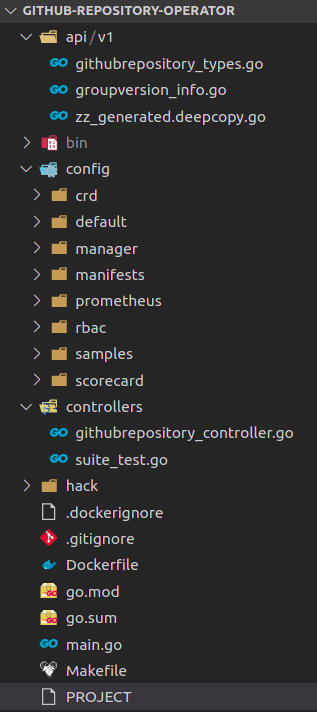
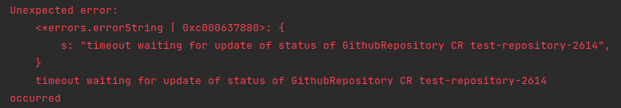
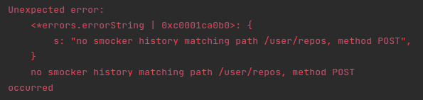

# Introduction

Kubernetes operator is one of the patterns that allows you to extend Kubernetes to fit your business requirements. This series of posts is going to go through the process of creating a very simple Kubernetes operator following TDD approach. The posts assume prior knowledge of Kubernetes operator pattern, what it is, when to use it, basic concepts of operator pattern like reconcillation loop etc. Below are some links to get started on that:

- https://kubernetes.io/docs/concepts/extend-kubernetes/operator/
- https://www.redhat.com/en/topics/containers/what-is-a-kubernetes-operator

# The Operator

The operator that we are going to build is a Github Repository Operator. It allows us to create custom resources `GithubRepository` and the operator will create actual github repositories using specification from those CRs. It's just a toy example and probably not going to give much value in real life, but it's complicated enough to demonstrate TDD and operator development process.

How the series is going to look like:

- Scaffold and first slice of the operator: creation of github repository (this post)
- [Update and delete of github repository]()
- Creating of github repository by cloning another repository (TODO)
- Validation using webhooks (TODO)

# Planning

Before diving into actual coding, we need to plan how the custom resource is going to look like, what fields it should support. For now, the CR is going to contain a few fields:

- `owner`, `repo`, `description`: github owner, name and description of the repository to be created
- `templateOwner`, `templateRepo`: (optional) owner and repository name of a template repository to clone from

```yaml
apiVersion: "pnguyen.io/v1"
kind: GithubRepository
metadata:
  name: "my-repository"
spec:
  owner: "hpcsc"
  repo: "my-repository"
  description: "some repository"
  templateOwner: "another-owner"
  templateRepo: "another-repo"
```

Some requirements:

- `owner` and `repo` cannot be changed after created the first time. We need some validation to enforce this
- `templateOwner` and `templateRepo` are only used during creation and ignored during update

# Get started

## Scaffold the project

We are going to use [Operator SDK](https://github.com/operator-framework/operator-sdk) version 1.8.1
Let's scaffold the project directory:

```shell
mkdir github-repository-operator
cd github-repository-operator
operator-sdk init --domain pnguyen.io --repo github.com/hpcsc/github-repository-operator
```

And generate skeleton for our controller

```shell
operator-sdk create api --group pnguyen.io --version v1 --kind GithubRepository --resource --controller
```

Let's go over some of the most important directories/files in the generated project:



- `api/v1/githubrepository_types.go`: contain Go declaration of our custom resource, its spec and status structure. We are going to modify this file next to add additional fields that we need above
- `controllers/githubrepository_controller.go`: our controller. The most important function here is `Reconcile`, which is called whenever there's any update to the custom resource
- `config`: this contains a bunch of yaml files for various things. It has a lot of files and it took me a while to understand purpose of each config the first time, so hopefully below explaination makes it easier for you to understand:

    - `samples`: example `GithubRepository` resource definition file
    - `crd`: CRD definition for `GithubRepository` resource
    - `manager`/`prometheus`/`rbac`: actual resource definition to deploy controller-manager, prometheus monitor etc, acting as bases for kustomize
    - `default`: kustomize patches, to be applied on top of bases above

## Add fake Github API

The operator needs to interact with Github API. For quick feedback and safer local development and testing, we should use a fake Github API server that responds to above endpoints. For this, I choose [smocker](https://smocker.dev/guide/)

Let's add a Make task and script to start smocker docker container in the background:

```shell
SMOCKER_VERSION=0.16.2
CONTAINER_NAME=fake-github

SCRIPT_DIR=$(cd $(dirname $0); pwd)

if [ ! -z "$(docker ps -a -f name=${CONTAINER_NAME} --format '{{.Names}}')" ]; then
    echo  "=== Container ${CONTAINER_NAME} exists, removing it"
    docker rm -f ${CONTAINER_NAME}
fi

echo  "=== Creating container ${CONTAINER_NAME}"
docker run -d \
    -p 8088:8080 \
    -p 8089:8081 \
    --name ${CONTAINER_NAME} \
    thiht/smocker:${SMOCKER_VERSION}


for MOCK_DEFINITION in ${SCRIPT_DIR}/../smocker/*; do
    echo "Registering mock definition from ${MOCK_DEFINTION}"

    curl -X POST \
        -H "Content-Type: application/x-yaml" \
        http://localhost:8089/mocks \
        --data-binary @${MOCK_DEFINITION}
done
```

This script also uses smocker admin api to register mock definitions (There is no easy way to let smocker load mock definitions automatically when starting up at the moment). For now we don't have any mock definition yet. They will be added progressively when we develop the operator.

Smocker provides a convenient admin UI that can be accessed at `http://localhost:8089`

## First end to end test

We will follow outside-in TDD and start with an end to end test to verify that when a `GithubRepository` custom resource is created, it will create the corresponding github repository using Github API

The skeleton of end to end test (in Ginkgo) is already created for us at `controllers/suite_test.go`. Let's modify the `BeforeSuite` to add in this code at the end:

```go
logf.Log.Info("Creating new manager")
mgr, err := ctrl.NewManager(cfg, ctrl.Options{
  Scheme: scheme.Scheme,
})
Expect(err).NotTo(HaveOccurred())

err = (&GithubRepositoryReconciler{
  Client: mgr.GetClient(),
  Scheme: mgr.GetScheme(),
}).SetupWithManager(mgr)
Expect(err).NotTo(HaveOccurred())

go func() {
  os.Setenv(GithubApiBaseUrlKey, "http://localhost:8088")
  os.Setenv(GithubApiUploadUrlKey, "http://localhost:8088")
  os.Setenv(GithubApiTokenKey, "valid-token")

  defer os.Unsetenv(GithubApiBaseUrlKey)
  defer os.Unsetenv(GithubApiUploadUrlKey)
  defer os.Unsetenv(GithubApiTokenKey)
  defer GinkgoRecover()

  err = mgr.Start(ctrl.SetupSignalHandler())
  Expect(err).ToNot(HaveOccurred())
}()

k8sClient = mgr.GetClient()
Expect(err).NotTo(HaveOccurred())
Expect(k8sClient).NotTo(BeNil())
```

The generated code starts [EnvTest](https://sdk.operatorframework.io/docs/building-operators/golang/testing/) but doesn't create the controller manager or register our reconciler with any manager. The snippet above does that and also creates a kubernetes client so that we can query kubernetes server.

Now the setup and teardown are propertly wired up, let's add the first test:

```go
var _ = Describe("GithubRepository Controller", func() {
	Context("When GithubRepository resource created", func() {
		var name, namespace string
		var githubRepository pnguyeniov1.GithubRepository

		BeforeEach(func() {
			namespace = "default"
			name = fmt.Sprintf("test-repository-%d", rand.IntnRange(1000, 9000))
		})

		It("should create github repository using github API", func() {
			githubRepository = pnguyeniov1.GithubRepository{
				ObjectMeta: metav1.ObjectMeta{
					Name:      name,
					Namespace: namespace,
				},
				Spec: pnguyeniov1.GithubRepositorySpec{
					Owner:       "test-owner",
					Repo:        name,
					Description: "test-description",
				},
			}

			err := k8sClient.Create(context.TODO(), &githubRepository)
			Expect(err).NotTo(HaveOccurred())

			err = waitUntilSuccessful(name, namespace)
			Expect(err).NotTo(HaveOccurred())

			history, err := smockerRequestByPath("/user/repos", "POST", "name", name)
			Expect(err).NotTo(HaveOccurred())

			Expect(history.Response.Status).To(Equal(201))
			Expect(history.Response.Body.(map[string]interface{})["name"]).To(Equal(name))

		})

		AfterEach(func() {
			err := k8sClient.Delete(context.TODO(), &githubRepository)
			if err != nil {
				logf.Log.Error(err, "failed to delete GithubRepository", "name", name)
			}
		})
	})
})
```

this test uses kubernetes client to create a `GithubRepository` custom resource. There are 2 things we want to verify as the result of reconcillation:

- The custom resource status is updated to successful after reconcillation. This is verified by these 2 lines:

  ```go
  err = waitUntilSuccessful(name, namespace)
  Expect(err).NotTo(HaveOccurred())
  ```

- The reconcillation invoke Github API to create repository. To verify this, we query smocker admin API for the request history and make sure that history matches our expectation.

We can already see that the test is not compilable becuse `GithubRepositorySpec` and `GithubRepositoryStatus` do not contain the fields we want in the test. Let's quickly go to `api/v1/githubrepository_types.go` and add those in:

```go
type GithubRepositorySpec struct {
	Owner         string `json:"owner"`
	Repo          string `json:"repo"`
	Description   string `json:"description,omitempty"`
}

type GithubRepositoryStatus struct {
	Successful bool `json:"successful"`
}
```

Now run the test with `make test` and it should fail with below error:



## Fix the test

The simplest way to fix above error is to just update the status to successful without doing anything:

```go
func (r *GithubRepositoryReconciler) Reconcile(ctx context.Context, req ctrl.Request) (ctrl.Result, error) {
	logger := log.FromContext(ctx)

	var resource pnguyeniov1.GithubRepository
	if err := r.Get(ctx, req.NamespacedName, &resource); err != nil {
		if errors.IsNotFound(err) {
			// CR might be deleted after reconciliation request is triggered. No need to requeue
			return ctrl.Result{}, nil
		}

		return ctrl.Result{}, fmt.Errorf("unable to fetch GithubRepository: %v", err)
	}


	resource.Status.Successful = true
	if err := r.Status().Update(ctx, &resource); err != nil {
		return ctrl.Result{}, fmt.Errorf("unable to update status of GithubRepository resource: %v", err)
	}

	logger.Info("github repository created successfully")

	return ctrl.Result{}, nil
}
```

The test should fail with 2nd error message:




To fix it, we need to invoke Github API to create repository. We will use [Go Github](https://github.com/google/go-github) for that:

```shell
go get github.com/google/go-github/v37
```

the logic to call github API does not belong to controller reconcillation function and should have its own package.

There are several ways to design the new package:

- It can be a package that is specific to github api. Client of this package will explicitly call function like: `github.CreateRepository()`, `github.DeleteRepository()` etc. It's simpler but client's tied to this specific implementation.
- Or it can be a general package like `repository` with an exposed contract/interface to the client. Github is only an implementation. Other possible implementations are gitlab, bitbucket etc (assuming all of them having similar apis that we need). This is a bit more future-proof and flexile, with the cost of more abstraction and complexity. Another minor disadvantage is that we need to rename our project and controller since it is no longer specific to github.

I'm not a fan of over-engineering so will choose approach 1 for now. If there's a need to make it more generic in the future, it's simpler enough to extract interface and move to approach 2.

## Add new package

Ideally the new package name should be `github`, but it's taken by `go-github` library above, so let's call the new package `githubapi`


Tests for this new package are going to be integration tests. Integration is an overloaded term. Different people have their own definition of integration tests. For me, integration tests verify the interaction at the edge/boundary of the system with external system. In this case, they are verifying the interaction between our github API client code and github api (smocker in local).

I find it easier to start with a negative test case: return authorization error when we don't provide token. This is a possible error returned from github api. We actually don't care what error returned, as long as that same error's returned by `CreateRepository()`, so any type of error works:

```go
func TestCreateRepository(t *testing.T) {
	t.Run("return error when failed to create repository", func(t *testing.T) {
		baseUrl := "http://localhost:8088"
		uploadUrl := "http://localhost:8088"
		token := ""
		api := New(context.TODO(), baseUrl, uploadUrl, token)

		err := api.CreateRepository("test-owner", "test-repo", "some-description")

		require.Error(t, err)
		require.Contains(t, err.Error(), "failed to create repository test-repo")
	})
}
```

To make it pass, we need to add a smocker definition file at `local/smocker/no-token-error.yaml`:

```yaml
- request:
    path: /api/v3/user/repos
    method: POST
    headers:
      Authorization: Bearer
      Content-Type: application/json
  response:
    status: 401
    headers:
      Content-Type: application/json
    body: ''
```

and implement the code:

```go
type api struct {
	ctx       context.Context
	baseUrl   string
	uploadUrl string
	token     string
}

func (a *api) CreateRepository(owner, repo, description string) error {
	ts := oauth2.StaticTokenSource(&oauth2.Token{AccessToken: a.token})
	oauthClient := oauth2.NewClient(a.ctx, ts)
	client, err := github.NewEnterpriseClient(a.baseUrl, a.uploadUrl, oauthClient)
	if err != nil {
		return fmt.Errorf("failed to create github client: %v", err)
	}

	repository := github.Repository{
		Name:        &repo,
		Description: &description,
	}

	_, _, err = client.Repositories.Create(a.ctx, "", &repository)

	if err != nil {
		return fmt.Errorf("failed to create repository %s: error: %v", repo, err)
	}

	return nil
}

func New(ctx context.Context, baseUrl, uploadUrl, token string) *api {
	return &api{
		ctx:       ctx,
		baseUrl:   baseUrl,
		uploadUrl: uploadUrl,
		token:     token,
	}
}
```

next test is to verify happy path. We need a way to verify that smocker is called with POST request to create the repository. This is similar to what we did in the end to end test. So before creating this test, we need to move the utility functions to verify smocker call to an internal package `smocker`. It's not ideal to create a package for something that is used only in test, but I can't find a better way to share test utility in golang. After moving the smocker utility to new package, we can write the new test:

```go
t.Run("invoke github api when repository created", func(t *testing.T) {
	baseUrl := "http://localhost:8088"
	uploadUrl := "http://localhost:8088"
	token := "valid-token"
	repoName := fmt.Sprintf("test-repo-%d", rand.IntnRange(1000, 9000))

	api := New(context.TODO(), baseUrl, uploadUrl, token)
	err := api.CreateRepository("test-owner", repoName, "some-description")

	require.NoError(t, err)
	history, err := smocker.RequestByPath("/user/repos", "POST", "name", repoName)
	require.NoError(t, err)
	require.Equal(t, http.StatusCreated, history.Response.Status)
	require.Equal(t, repoName, history.Response.Body.(map[string]interface{})["name"])
})
```

add another mock definition file to make it pass: this mock matches on `Authorization` header with `valid-token` value and uses dynamic response to return the same repo name from request in the body. The body is only partial response from Github API.

```yaml
- request:
    path: /api/v3/user/repos
    method: POST
    headers:
      Authorization: Bearer valid-token
      Content-Type: application/json
  dynamic_response:
    engine: go_template
    script: |-
      status: 201
      headers:
        Content-Type: [application/json]
      body: >
        {
          "id": 1296269,
          "name": "{{.Request.Body.name}}",
          "full_name": "{{.Request.Body.name}}"
        }
```

One last thing: for now we only focus on creation, and we don't want to call github API creation endpoint again if the repo already exists (the api will return an error). We will check whether the repository with that name exists before creating it. When we work on update scenario later, this test can be modified to support that.

```go
t.Run("not invoke github api creation when repository exists", func(t *testing.T) {
	baseUrl := "http://localhost:8088"
	uploadUrl := "http://localhost:8088"
	token := "valid-token"
	repoName := fmt.Sprintf("existing-repo-%d", rand.IntnRange(1000, 9000))

	api := New(context.TODO(), baseUrl, uploadUrl, token)

	err := api.CreateRepository("test-owner", repoName, "some-description")

	require.NoError(t, err)
	_, err = smocker.RequestByPath("/user/repos", "POST", "name", repoName)
	require.Error(t, err)
	require.Contains(t, err.Error(), "no smocker history matching")
})
```

and implementation:

```go
func (a *api) CreateRepository(owner, repo, description string) error {
	// ...

	_, resp, err := client.Repositories.Get(a.ctx, owner, repo)
	if err != nil && resp.StatusCode != http.StatusNotFound {
		return fmt.Errorf("failed to get repository %s: error: %v", repo, err)
	}

	if resp.StatusCode != http.StatusNotFound {
		// only work with repo creation for now
		return nil
	}

	// ...
}
```

`githubapi` package is done, now just need to use it in controller:

```go
baseUrl := getEnv(GithubApiBaseUrlKey, "https://api.github.com/")
uploadUrl := getEnv(GithubApiUploadUrlKey, "https://uploads.github.com/")
token := os.Getenv(GithubApiTokenKey)

api := githubapi.New(ctx, baseUrl, uploadUrl, token)
if err := api.CreateRepository(resource.Spec.Owner, resource.Spec.Repo, resource.Spec.Description); err != nil {
  return ctrl.Result{}, err
}
```

The end to end test should pass now

## Test it out

Our code is all wired up, let's test it out:

- Go to Github -> Settings -> Developer settings -> Personal access tokens -> Generate new tokens, give it `Repo` permission
- Export token above as `GITHUB_API_TOKEN` environment variable in your terminal
- Run `make install` to install CRD to your local kubernetes cluster
- Run `make run` to run controller in your terminal
- Update sample CR at `./config/samples/pnguyen.io_v1_githubrepository.yaml`
- In another terminal, run `kubectl apply -f ./config/samples/pnguyen.io_v1_githubrepository.yaml`
- Verify that new github repository created
- Run `kubectl get githubrepository your-cr-name -o yaml` and check that `status.successful` is set to true
