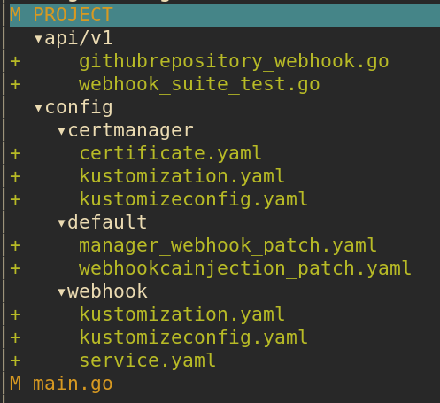

So far we have ignored most of the validation of custom resource when implementing the operator in the previous 3 posts. That's the topic of today post

# Posts in the series

- [Scaffold and first slice of the operator: creation of github repository]()
- [Update and delete of github repository]()
- [Creating of github repository by cloning another repository]()
- Validation using webhooks (this post)

# Types of validation

Operator SDK supports both OpenAPIv3 validation and webhook validation. We are going to add both of them to our operator:

- OpenAPI validation:
	- `owner` and `repo` fields are required
- Webhook validation:
	- `templateOwner` and `templateRepo` must not be the same with `owner` and `repo`
	- `templateOwner` and `templateRepo` if present must refer to an existing repo in github that is marked as template repository

# Add OpenAPI validation

We can use OpenAPI schema to validate a few simple things like whether a field is required, whether it's in correct format, etc. In our case, both `owner` and `repo` are string and are already required by default, but users still can pass in empty string, which we should be able to catch easily.

The test (I put in `controllers/suite_test.go` because this relies on Kubernetes API server to perform the validation, so we need all the setup in end to end test):

```go
// controllers/suite_test.go
Context("When GithubRepository resource created", func() {
	It("return error when owner or repo are missing", func() {
		namespace := "default"
		name := fmt.Sprintf("test-repository-%d", rand.IntnRange(1000, 9000))
		githubRepository := pnguyeniov1.GithubRepository{
			ObjectMeta: metav1.ObjectMeta{
				Name:      name,
				Namespace: namespace,
			},
			Spec: pnguyeniov1.GithubRepositorySpec{
				Repo:        name,
				Description: "test-description",
			},
		}

		err := k8sClient.Create(context.TODO(), &githubRepository)
		Expect(err).To(HaveOccurred())
		Expect(err.Error()).To(ContainSubstring("spec.owner: Invalid value"))

		githubRepository.Spec.Owner = "test-owner"
		githubRepository.Spec.Repo = ""

		err = k8sClient.Create(context.TODO(), &githubRepository)
		Expect(err).To(HaveOccurred())
		Expect(err.Error()).To(ContainSubstring("spec.repo: Invalid value"))
	})
})
```

To fix this test, just need to add kubebuilder marker in `GithubRepositorySpec` `Owner` and `Repo` fields:

```go
// api/v1/githubrepository_types.go
type GithubRepositorySpec struct {
	//+kubebuilder:validation:MinLength:=1
	Owner string `json:"owner"`
	//+kubebuilder:validation:MinLength:=1
	Repo          string `json:"repo"`
	// ...
}
```

Run `make manifest` to re-generate CRD and run the tests again to see it pass.

# Scaffold validating webhook

Operator sdk supports scaffolding several types of webhook:
- validating webhook: to perform validation that we cannot do with OpenAPI validation, created by `--programmatic-validation` flag
- mutating/defaulting webhook: to set default values for fields or mutate objects for other purposes, created by `--defaulting` flag
- conversion webhook: to convert from one version of CRD to another, created by `--conversion` flag

In our case, we just need validating webhook. To scaffold it, run the following command:

```shell
operator-sdk create webhook \
	--group pnguyen.io \
	--version v1 \
	--kind GithubRepository \
	--programmatic-validation
```

Here are the files generated by above command:



- `config`:
	- `certmanager`: kustomize files to configure CertManager. CertManager is used to automate generation of certificate for our webhook.
	- `webhook`: kustomize files for `ValidatingWebhookConfiguration` and webhook kubernetes service
	- `default`:
		- `manager_webhook_patch.yaml`: add volume and volume mount for webhook cert to `controller-manager` deployment.
		- `webhookcainjection_patch.yaml`: setup annotation for CertManager to inject CA cert into `ValidatingWebhookConfiguration`. This CA cert is used by API server to verify TLS connection with webhook.
- `api/v1/githubrepository_webhook.go`: webhook code
- `main.go`: the code generation also modifies `main.go` to include the following code to setup webhook with manager:

```go
if err = (&pnguyeniov1.GithubRepository{}).SetupWebhookWithManager(mgr); err != nil {
	setupLog.Error(err, "unable to create webhook", "webhook", "GithubRepository")
	os.Exit(1)
}
```

Run `make manifests` will create an additional file `config/webhook/manifests.yaml`: this is `ValidatingWebhookConfiguration` generated from `+kubebuilder:webhook` marker in `api/v1/githubrepository_webhook.go`.

Before we can test those new files, we need to uncomment all lines with `[WEBHOOK]` or `CERTMANAGER` in `config/crd/kustomization.yaml` and `config/default/kustomization.yaml`

To be honest, all those kustomize configs can be quite confusing, so I draw this diagram to illustrate relationship between different directories under `config`:


Basically `default` is the top most kustomize overlay and is the main one that we need to interact with. It uses other directories like `crd`, `webhook`, `certmanager`, `rbac`, `manager` as bases and provides patches to patch resources from those bases.

# Run generated validating webhook

## Run outside of Kubernetes cluster

Webhook requires a TLS cert at `${TMPDIR}/k8s-webhook-server/serving-certs/{tls.[crt|key]}` when starting up. When webhook is deployed to a Kubernetes cluster, this will be provided by CertManager. To run webhook outside of cluster, we can generate the cert ourselves by using following make task:

```shell
webhook-certs: ## generate self-signed cert and key for local webhook development
	mkdir -p ${TMPDIR}/k8s-webhook-server/serving-certs
	openssl req -x509 \
				-newkey rsa:2048 \
				-nodes \
				-keyout ${TMPDIR}/k8s-webhook-server/serving-certs/tls.key \
				-out ${TMPDIR}/k8s-webhook-server/serving-certs/tls.crt \
				-days 365 \
				-subj '/CN=local-webhook'
```

Run the following commands:

```shell
make install # install CRD
make build
make webhook-certs
export GITHUB_API_TOKEN={your-github-api-token} # Our controller needs to interact with Github API
make run
```

You should see a log like `serving webhook server  {"host": "", "port": 9443}` in the terminal

Since the webhook is running outside of Kubernetes cluster, Kubernetes API server is not aware of this webhook and will not invoke it when a new CR is created/updated. It's just a http server so we can interact with it through curl like following script:

```shell
#!/bin/bash

set -euo pipefail

TYPE=${1:-validate}

if [ "${TYPE}" != "mutate" ] && [ "${TYPE}" != "validate" ]; then
  echo "invalid webhook type: ${TYPE}"
  echo "usage: $0 [mutate|validate]"
  exit 1
fi;

SCRIPT_DIR=$(cd $(dirname $0); pwd)

curl -k --request POST "https://127.0.0.1:9443/${TYPE}-github-pnguyen-io-v1-githubrepository" \
        -H "Content-Type: application/json" \
        --data-binary @"${SCRIPT_DIR}/admission-review-request.json"
```

This script by default invokes validating webhook endpoint with payload from the file `admission-review-request.json`:

```json
{
  "apiVersion": "admission.k8s.io/v1",
  "kind": "AdmissionReview",
	// ...
    "object": {
      "apiVersion": "github.pnguyen.io/v1",
      "kind": "GithubRepository",
      "metadata": {
        "name": "githubrepository-sample",
        "namespace": "default"
      },
      "spec": {
        "owner": "test-owner",
        "repo": "test-repository",
        "description": "my test repository",
        "templateOwner": "template-owner",
        "templateRepo": "template-repository"
      }
    },
	// ...
}
```

When invoking this script, you should see following logs in the first terminal, indicating the webhook was processing the request:

```
2021-08-15T13:03:21.277+1000    DEBUG   controller-runtime.webhook.webhooks     received request        {"webhook": "/validate-github-pnguyen-io-v1-githubrepository", "UID": "705ab4f5-6393-11e8-b7cc-42010a800002", "kind": "github.pnguyen.io/v1, Kind=GithubRepository", "resource": {"group":"github.pnguyen.io","version":"v1","resource":""}}
2021-08-15T13:03:21.278+1000    INFO    githubrepository-resource       validate update {"name": "githubrepository-sample"}
2021-08-15T13:03:21.278+1000    DEBUG   controller-runtime.webhook.webhooks     wrote response  {"webhook": "/validate-github-pnguyen-io-v1-githubrepository", "code": 200, "reason": "", "UID": "705ab4f5-6393-11e8-b7cc-42010a800002", "allowed": true}
```

## Run inside Kubernetes cluster

Previous method can be used for quick validation during development. Once we are done with webhook implementation, we can deploy webhook to a Kubernetes cluster and test it out.

First install CertManager:

```shell
kubectl apply -f https://github.com/jetstack/cert-manager/releases/latest/download/cert-manager.yaml
```

Then run following commands:

```shell
make docker-build IMG=controller:0.0.1 # build docker image controller:0.0.1
minikube image load controller:0.0.1 # load controller:latest image into minikube
make deploy IMG=controller:0.0.1 # run `kustomize build config/default` and apply generated config
```

Once everything's done, a new namespace `github-repository-operator-system` is created. You will see our controller is deployed as deployment there.

Now let's create a custom resource:

```shell
kubectl apply -f ./config/samples/pnguyen.io_v1_githubrepository.yaml
```

You should see similar logs like above when inspecting controller pod log

# First webhook validation

Our first validation is to ensure that `templateOwner` and `templateRepo` fields are not the same with `owner` and `repo` fields. Add following end to end test:

```go
// api/v1/webhook_suite_test.go
var _ = Describe("GithubRepository Validating Webhook", func() {
	Context("when templateOwner and templateRepo are the same with owner and repo", func() {
		var name, namespace string
		var githubRepository GithubRepository

		BeforeEach(func() {
			namespace = "default"
			name = fmt.Sprintf("test-github-repository-%d", rand.IntnRange(1000, 9000))
		})

		It("should return error", func() {
			githubRepository = GithubRepository{
				ObjectMeta: metav1.ObjectMeta{
					Name:      name,
					Namespace: namespace,
				},
				Spec: GithubRepositorySpec{
					Owner:         "test-owner",
					Repo:          "test-repo",
					TemplateOwner: "test-owner",
					TemplateRepo:  "test-repo",
				},
			}

			err := k8sClient.Create(context.TODO(), &githubRepository)
			Expect(err).To(HaveOccurred())

			Expect(err.Error()).To(ContainSubstring("denied the request: templateOwner/templateRepo must be different with owner/repo"))
		})
	})
})
```

Add following implementation in `ValidateCreate()`:

```go
func (r *GithubRepository) ValidateCreate() error {
	githubrepositorylog.Info("validate create", "name", r.Name)

	if r.Spec.TemplateOwner == r.Spec.Owner && r.Spec.TemplateRepo == r.Spec.Repo {
		return fmt.Errorf("templateOwner/templateRepo must be different with owner/repo")
	}

	return nil
}
```

The test should pass now. Note that we just need to implement validation during creation of CR because template owner/repo are only used in the first time creation. They will be ignored in update requests.

# Second webhook validation

The 2nd validation is more complicated: `templateOwner` and `templateRepo` if present must refer to an existing repo in github that is marked as template repository

In order to validate this, we need to invoke github api in our webhook to check whether the given `templateOwner`/`templateRepo` satisfy above requirement.

Let's add 2 end to end tests: one for happy path, the other for unhappy path. Strictly speaking, we kind of get ahead of ourselves here since we add 2 tests consecutively. Since the implementation is just to check a boolean flag from returned github api response, once we pass the 1st test, the other test will pass too. We can avoid it by purposely checking only for a specific value of `true` or `false` so that the two tests not pass at the same time but I find it unnecessary.

```go
// api/v1/webhook_suite_test.go
Context("when templateOwner and templateRepo refer to a non-template repository", func() {
	var name, namespace string
	var githubRepository GithubRepository

	BeforeEach(func() {
		namespace = "default"
		name = fmt.Sprintf("test-github-repository-%d", rand.IntnRange(1000, 9000))
	})

	It("should return error", func() {
		templateRepo := fmt.Sprintf("non-template-repo-%d", rand.IntnRange(1000, 9000))
		githubRepository = GithubRepository{
			ObjectMeta: metav1.ObjectMeta{
				Name:      name,
				Namespace: namespace,
			},
			Spec: GithubRepositorySpec{
				Owner:         "test-owner",
				Repo:          "test-repo",
				TemplateOwner: "test-owner",
				TemplateRepo:  templateRepo,
			},
		}

		err := k8sClient.Create(context.TODO(), &githubRepository)
		Expect(err).To(HaveOccurred())

		Expect(err.Error()).To(ContainSubstring(fmt.Sprintf("repository test-owner/%s is not marked as template", templateRepo)))
	})
})

Context("when templateOwner and templateRepo refer to a valid template repository", func() {
	var name, namespace string
	var githubRepository GithubRepository

	BeforeEach(func() {
		namespace = "default"
		name = fmt.Sprintf("test-github-repository-%d", rand.IntnRange(1000, 9000))
	})

	It("should not return error", func() {
		templateRepo := fmt.Sprintf("valid-template-repo-%d", rand.IntnRange(1000, 9000))
		githubRepository = GithubRepository{
			ObjectMeta: metav1.ObjectMeta{
				Name:      name,
				Namespace: namespace,
			},
			Spec: GithubRepositorySpec{
				Owner:         "test-owner",
				Repo:          "test-repo",
				TemplateOwner: "test-owner",
				TemplateRepo:  templateRepo,
			},
		}

		err := k8sClient.Create(context.TODO(), &githubRepository)
		Expect(err).NotTo(HaveOccurred())
	})
})
```

We know that we need to make a call to github api to check whether given repository is marked as template repository, so we need to add a function `IsTemplateRepository()` to `githubapi` package.

I'll not bore you with the details of adding this function to `githubapi` package since it's pretty straightforward and similar to what we did previously. The signature of the function looks like this when it's completed:

```go
// internal/githubapi/api.go
func (a *api) IsTemplateRepository(owner, repo string) (bool, error) {
	// ...
}
```

Before calling this function in webhook, we need to do a little bit of refactoring. Previously we get github api url and token from environment in controller like this:

```go
//
baseUrl := getEnv(GithubApiBaseUrlKey, "https://api.github.com/")
uploadUrl := getEnv(GithubApiUploadUrlKey, "https://uploads.github.com/")
token := os.Getenv(GithubApiTokenKey)
```

Now we need to do the same thing in webhook, so it might be better to move this initialisation logic to `githubapi` package itself:

```go
// internal/githubapi/api.go
func NewFromEnvironment(ctx context.Context) (*api, error) {
	baseUrl := getEnv(GithubApiBaseUrlKey, "https://api.github.com/")
	uploadUrl := getEnv(GithubApiUploadUrlKey, "https://uploads.github.com/")
	token := os.Getenv(GithubApiTokenKey)

	return new(ctx, baseUrl, uploadUrl, token)
}

// controllers/githubrepository_controller.go
api, err := githubapi.NewFromEnvironment(ctx)
```

Original `githubapi.New()` function is made into a private function since it's only used within the package.

Implementation of webhook to pass the 2nd end to end test is simple:

```go
// api/v1/githubrepository_webhook.go
func (r *GithubRepository) ValidateCreate() error {
	githubrepositorylog.Info("validate create", "name", r.Name)

	if r.Spec.TemplateOwner != "" && r.Spec.TemplateRepo != "" {
		if r.Spec.TemplateOwner == r.Spec.Owner && r.Spec.TemplateRepo == r.Spec.Repo {
			return fmt.Errorf("templateOwner/templateRepo must be different with owner/repo")
		}

		api, err := githubapi.NewFromEnvironment(context.Background())
		if err != nil {
			return err
		}

		isTemplate, err := api.IsTemplateRepository(r.Spec.TemplateOwner, r.Spec.TemplateRepo)
		if !isTemplate {
			return fmt.Errorf("repository %s/%s is not marked as template", r.Spec.TemplateOwner, r.Spec.TemplateRepo)
		}
	}

	return nil
}
```

# Test it out

- Export github token as `GITHUB_API_TOKEN` environment variable in your terminal
- Run `make install` to install CRD to your local kubernetes cluster
- Run `make webhook-certs` to generate certs at `${TMPDIR}/k8s-webhook-server/serving-certs` for webhook
- Follow step in section `Run in Kubernetes cluster` above to deploy controller with webhook to local kubernetes cluster
- Update sample CR at `./config/samples/pnguyen.io_v1_githubrepository.yaml`:

```yaml
apiVersion: pnguyen.io.pnguyen.io/v1
kind: GithubRepository
metadata:
  name: operator-test
spec:
  owner: hpcsc
  repo: operator-test
  description: my sample operator test
  templateOwner: hpcsc
  templateRepo: operator-test
```

- In another terminal, run `kubectl apply -f ./config/samples/pnguyen.io_v1_githubrepository.yaml`, we should see error `error when creating "./config/samples/pnguyen.io_v1_githubrepository.yaml": admission webhook "vgithubrepository.kb.io" denied the request: templateOwner/templateRepo must be different with owner/repo` in the terminal.
- Update sample CR again with following content:

```yaml
apiVersion: pnguyen.io.pnguyen.io/v1
kind: GithubRepository
metadata:
  name: operator-test
spec:
  owner: hpcsc
  repo: operator-test
  description: my sample operator test
  templateOwner: hpcsc
  templateRepo: aws-profile
```

`aws-profile` is one of my repositories and not marked as template. Run `kubectl apply` again and we should see error: `admission webhook "vgithubrepository.kb.io" denied the request: repository hpcsc/aws-profile is not marked as template`

- Lastly, update the sample CR to:

```yaml
apiVersion: pnguyen.io.pnguyen.io/v1
kind: GithubRepository
metadata:
  name: operator-test
spec:
  owner: hpcsc
  repo: operator-test
  description: my sample operator test
  templateOwner: hpcsc
  templateRepo: asdf-plugin-template
```

`asdf-plugin-template` is a template repository so the repository should be created successfully
