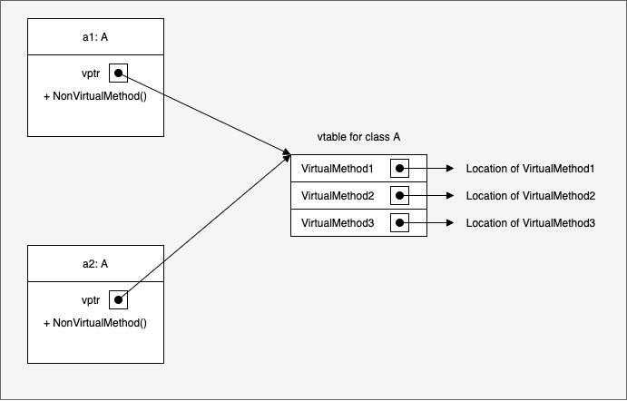
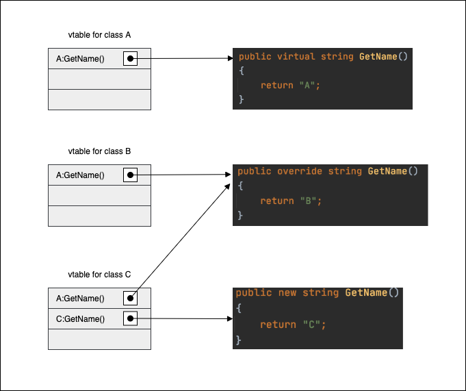
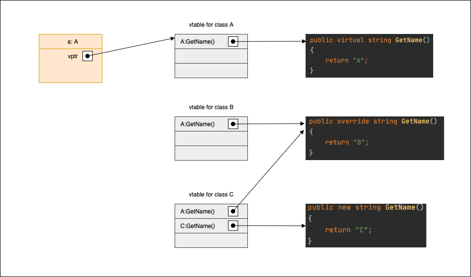
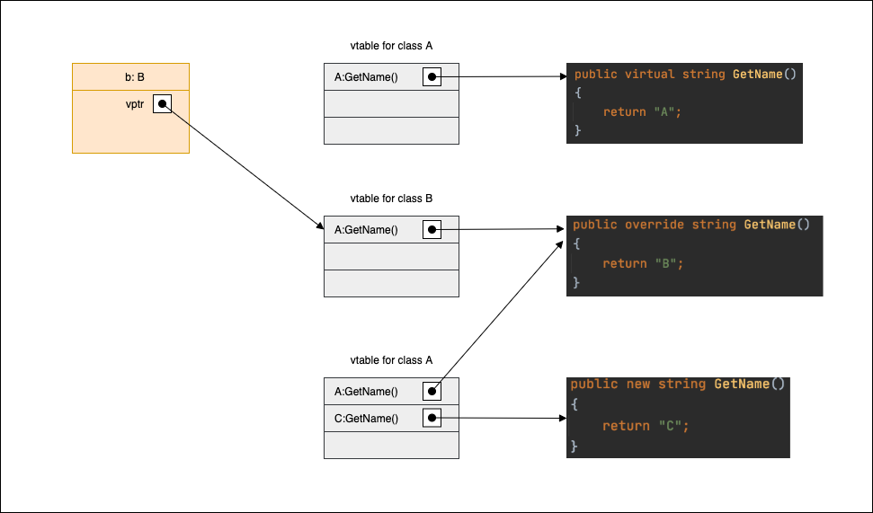
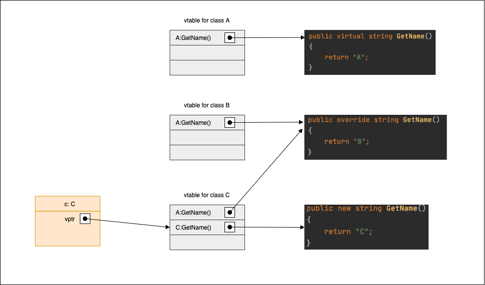
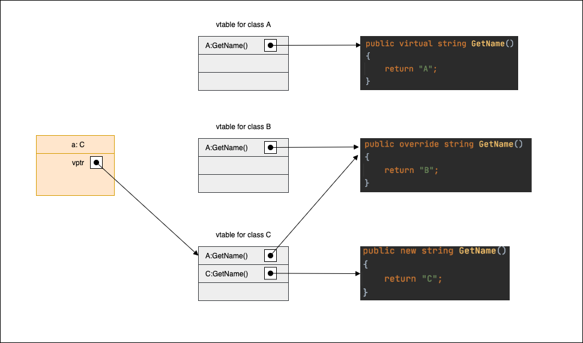

## Overview

This is a fundamental concept in C# but I find it difficult to find explanation that really goes into details of how it’s implemented in C#, so I decided to write a post to document what I understand about this.

In C#, base class can use `virtual` modifier for a method to indicate that that method can be overridden by sub class. Different from Java, C# doesn’t enable method overriding by default, so the base class must use this modifier to allow base class method to be overridden. With `virtual` modifier in base class, child class can use either `new` modifier or `override` modifier to hide or override the inherited method from base class.

Under the hood, C# uses `virtual method table` (`vtable`, `dispatch table`) to determine at run time which method from which class in the hierarchy to call. Each class that has at least one virtual method will have its own `vtable`. When created, every object instance of that class will have a pointer to `vtable` of the class (the pointer will always be at a fixed address from beginning of object address, so the runtime always knows where to find the vtable). That means all object instances of the same class will share the same `vtable`. It can be visualized like this:



In the diagram, a1 and a2 are 2 object instances of class `A`, both of them have a virtual method table pointer (`vptr`) to point to the same `vtable` of class `A`. `vtable` only contains entries for virtual methods declared in the class.

## Example

To understand behaviour of `new` and `override` modifiers with `vtable`, it’s easier to use an example:

- Let’s say we have 3 classes: `A`, `B` and `C`.
- `C` inherits `B` and `B` inherits `A`
- `B` overrides method `GetName()` from `A`, `C` hides method `GetName()` from `B`

```csharp
public class A
{
    public virtual string GetName()
    {
        return "A";
    }
}

public class B : A
{
    public override string GetName()
    {
        return "B";
    }
}

public class C : B
{
    public new string GetName()
    {
        return "C";
    }
}
```

## What happened at compile time and runtime?

At compile time, the structure of classes and their `vtable` might look like this:



Class `A` has one virtual method, so it has one `vtable` that contains an entry for that method. We identify that by `A:GetName()`.

Class `B` inherits from class `A`, so it also inherits the entries in class `A`’s `vtable`, which is `A:GetName()`. The modifier `override` in class `B` `GetName()` declaration will overwrite entry `A:GetName()` that it inherits to point to its own implementation.

Class `C` inherits from class `B`, so it also inherts the entries from class `B`’s `vtable`, which is `A:GetName()`. But in addition, class `C` says it wants to have a new entry for `GetName()` by specifying modifier `new` in `GetName()` declaration. The effect of that is in `vtable` of class `C`, beside the inherted `A:GetName()` from class `B`, it has its own entry for `C:GetName()`. This new entry `C:GetName()` points to its own implementation of `GetName()` while original entry `A:GetName()` points to the implementation that it inherits (from class `B`)

Now let’s come to the interesting part: at runtime, how it determines which method to call using `vtable`? We will consider 6 cases of declaring and instantiating instances of `A`, `B` and `C`.

### Case 1: A a = new A()

```csharp
A a = new A();
Console.WriteLine(a.GetName());    // A
```

We declare a variable of type `A`. Actual object instance is also of type `A`. So `vptr` of the variable `a` points to `vtable` of class `A`. When `a.GetName()` is called, it just follows the pointer to look into class `A` `vtable` and finds the implementation of `GetName()` from class `A`.



### Case 2: B b = new B()

```csharp
B b = new B();
Console.WriteLine(b.GetName());    // B
```

Similar to case 1 above, `vptr` of the variable `b` points to `vtable` of class `B`. When `GetName()` is called, it uses class `B` implementation of `GetName()`



### Case 3: C c = new C()

```csharp
C c = new C();
Console.WriteLine(c.GetName());     // C
```

In this case, `vptr` of the variable `c` points to `vtable` of class `C`. But one thing that is different is that in `vtable` of class `C`, we have 2 entries for `GetName()` and `C:GetName()` effectively hides `A:GetName()` when referenced through `C` variable. So `C` implementation of `GetName()` is the one actually called.



### Case 4: A a = new B()

```csharp
A a = new B();
Console.WriteLine(a.GetName());    // B
```

We have a variable of type `A` that holds reference to an object of type `B`. This means `vptr` of variable `a` points to class `B` `vtable`


### Case 5: A a = new C()

```csharp
A a = new C();
Console.WriteLine(a.GetName());    // B
```

We have a variable of type `A` that holds reference to an object of type `C`. This means `vptr` of variable `a` points to class `C` `vtable`. But notice that since we only have variable of type `A`, it doesn't know about the new entry `C:GetName()` in class `C` `vtable` and uses `A:GetName()` instead. As mentioned above, `A:GetName()` is pointing to class `B` implementation.



### Case 6: B b = new C()

```csharp
B b = new C();
Console.WriteLine(b.GetName());    // B
```

Similar to case 5 above, `vptr` points to class `C` `vtable` and it also uses `A:GetName()` entry in `vtable`.


And that's it. I hope we have a better visualization of what's going on behind the screen when `virtual`, `new` and `override` are used now.

## Reference

- http://stackoverflow.com/questions/1508350/why-does-this-polymorphic-c-sharp-code-print-what-it-does/1510702#1510702
